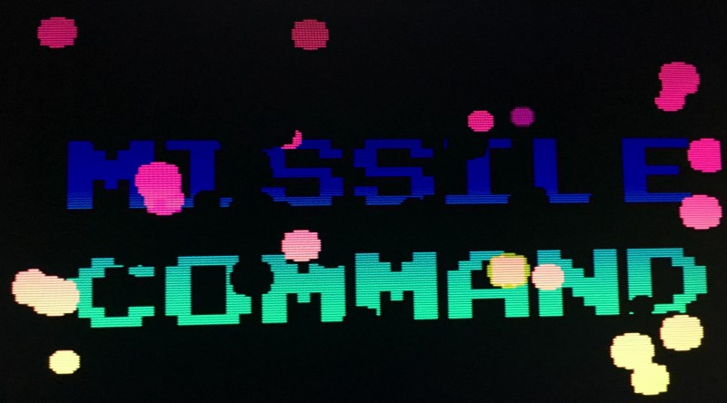
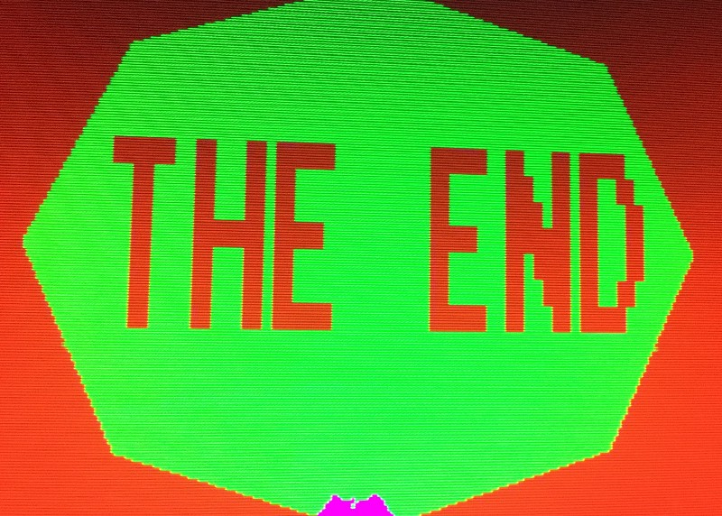

<!-----
title: Discovering Missile Command
description: A brief memory of an arcade game from 1980
date: '2016-10-22T15:47:33.469Z'
slug: 943fe5c73975
----->

The first time I played _Missile Command_ was at this arcade called _Captain’s Quarters_ that opened up on Brighton Beach Avenue near Coney Island Avenue in Brooklyn; just down the block from _Forty Thieves_. In fact it might have been the first game I ever played at _Captain’s Quarters_.

The great appeal of the game was using the huge trackball to move your target across the screen to intercept enemy missiles. The surreal part of the game is how you could never win. No matter how well you played, each level would get faster and faster until all of your cities are destroyed. Then the game was over and it would just end with a huge series of nuclear explosions appearing acoss the screen with the words, “The End” forming in the middle of it.

Not a “feel good” for a kid growing up in the middle of the Cold War in the 1970s/1980s, but still a fun game.

