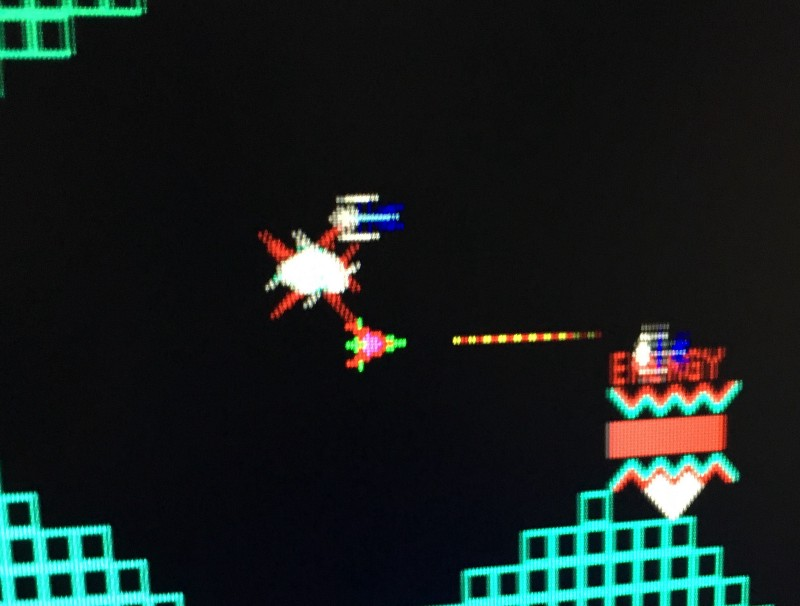

<!-----
title: Vanguard in a Dumpy Grocery Store
description: A brief memory of an arcade game from 1981
date: '2016-10-22T14:45:21.231Z'
slug: df5498f0b5d5
----->

The first time I played _Vanguard_ was in 1981/82 at some corner grocery store on Neptune Avenue near Brighton 2nd Street.

Weird detail, but I remember it being after school and the day was overcast to the point it seemed like it was going to rain. The grocery wasn’t sketchy but was one of these “Meh…” groceries that you could tell was once a decent place that was now a bit scattershot and on it’s way out.

_Vanguard_ was fun to play since there was a controller that moved you across a moving screen and 4 buttons to fire lasers in 4 different directions. It was definitely fun and a bit addictive but it was also one of the first arcade games I knew of where there was a clear ending; no rolling over the game to the beginning or just playing endlessly at some crazy high speed forever.

Getting to the end of the game was tough but it was fun to try to see how far I could get. I remember asking the clerk behind the counter for some change once and she gladly gave me 4 quarters and said a bit catatonically, “Is that game fun?” She was young but seemed burned out and all I said was “Yes!” and went back to playing the game.
