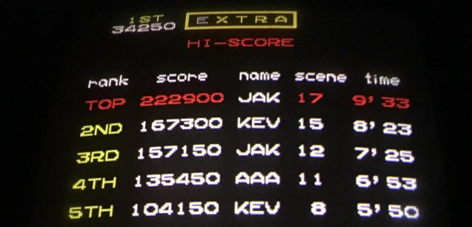

<!-----
title: Me and Mr. Do
description: A brief memory of an arcade game from 1982
date: '2016-10-22T02:59:07.815Z'
slug: 232ddfaf3d5
----->

Of all of the video games I ever played as a kid, _Mr. Do_ was the one I was truly most obsessed with.

I first played it in 1982/83 at some candy store in Brooklyn on Neptune Avenue near Brighton 6th or 5th street or something like that. This was literally the only arcade game they had in this small, well stocked, completely legit shop and they took pretty good care of it. The owners would gladly provide kids with change for the machines and the kids would gladly toss some of that change back buying the affordable snacks the shop had.

I was obsessed with _Mr. Do_ because the gameplay was fast, the graphics were cute and while it was technically a _Dig Dug_ clone, it was just much more fun to play. And there were all kinds of bonuses. I don’t remember the exact high scores I made, but was pretty high for a kid on an arcade machine in a dumpy neighborhood and other kids were impressed so I was happy: Finally I could earn some level of basic respect from other neighborhood kids by blowing my quarters on a silly little video game!