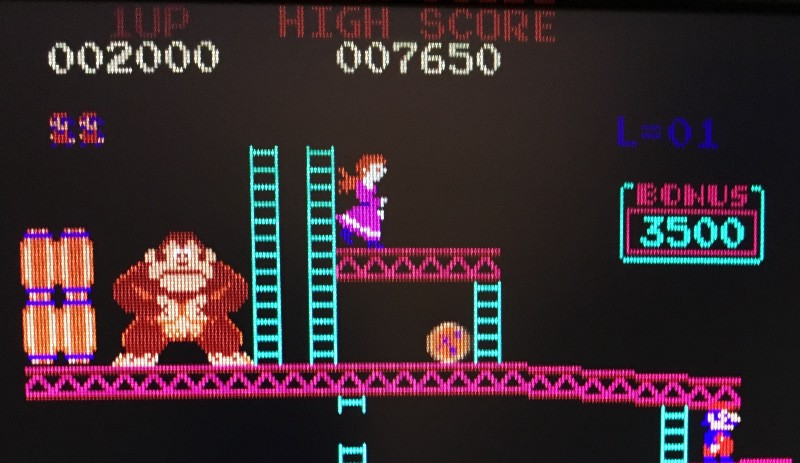

<!-----
title: Playing Donkey Kong
description: A brief memory of an arcade game from 1981
date: '2016-10-22T17:31:50.103Z'
slug: a081f2feb887
----->

The first time I ever played _Donkey Kong_ was at Met Food in 1981/82; it was supermarket across the street from my home on Brighton Beach Avenue and Ocean Parkway in Brooklyn.

I was walking down the block to head to either the library, toy store or bookstore and noticed the game cabinet near the main entrance. That supermarket never had video games before, but they were all the rage in the early 1980s so it was not surprising to find arcade games pop up in odd places.

I walked into the store and saw one a kid I knew in school, Aaron, playing the game. I looked over his shoulders and it looked cool. The characters seemed cool and it looked a little cartoonish; kind of like Popeye. Aaron asked me as he was playing, “You ever play this before, Jack?” I shook my head to say “No…” and he kept on playing.

After he was done, he pulled out some weird, pre-printed pad he had in is pocket; it looked like a guest check pad a waiter would use in a diner but it had all kinds of sports clipart on it. “Do you like football, Jack?” I turned to him and said “No…” and he persisted with trying to get me to bet on something. I said, “No…” again with that he put the pad back in his pocket, said goodbye to me and headed outside.

After he left, I took a quarter out of my pocket and tossed it in the machine to play _Donkey Kong_ myself. The game was fun and cute, but it seemed repetitive so I never got that into it. But it was a fun game to play while other people were watching since — like I said before — the graphics were cool and cute.