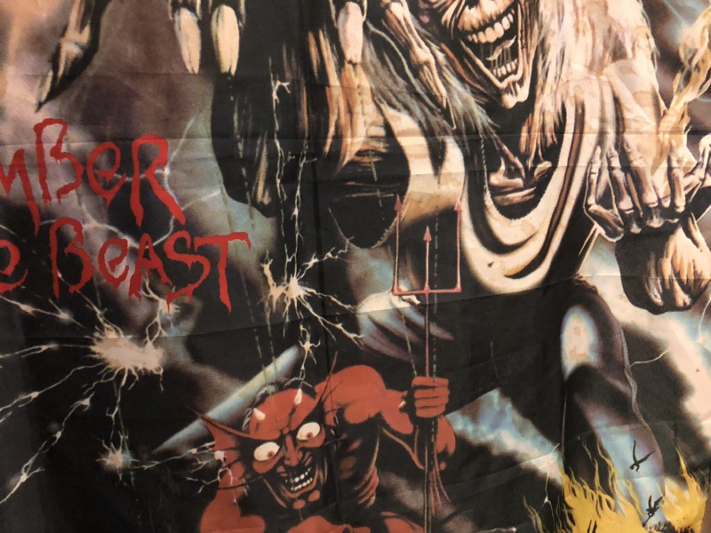

<!-----
title: 'Iron Maiden, Guns and Video Games'
description: About the Time I Had a Gun Pulled Out in Front of Me While Listening to Iron Maiden and Playing Video Games
date: '2018-02-28T12:23:03.158Z'
slug: 99a4574618b0
----->

I was hanging out at a neighborhood friend’s house in the early 1980s. We both had Atari computers — I had an Atari 400 and he had an Atari 800 — and we spent time copying games and trying to figure out how to play games we copied.

You see, if you pirated a video game back then — in the pre-Internet age — you didn’t necessarily get an instruction manual telling you how the game worked or even what the basic controls were. Were there keys on the keyboard you had to use? What happened if you did this thing during this screen and that thing during another screen? All that kind of basic stuff you would know if you actually purchased the game outright.

So part of the process of video game pirating — at least for me and my small circle of software pirating friends — was to do some primitive, improvised version of digital “forensics” with friends to figure out how these games worked. And when I say “digital” I don’t mean just 1s and 0s and bits and bytes. Often the hacking method we used was to just smash our hands across the keyboard to see what happened. It was a simple and effective method of figuring out how software worked without having to do things like decompile a binary and wade through raw, undocumented code.

Anyway, I was over at my friend’s place playing and copying some video games which was a tedious process back then since storage media and devices were slow, tedious and unreliable at best. Even more-so for a poor kid like me who couldn’t afford a disk drive at the time and only had a measly, slow data cassette tape drive to use.

So while we were waiting for games to copy, we’d often do other things teenagers did: Like listen to pop music and talk about nonsense and other bullshit. Like my friend’s new guitar.

“So what do you think about the guitar?” he asked while holding it, and strumming it, in his lap. The guitar in question was a classic black and white Fender Stratocaster. He just got it and a basic amp a week or so ago. He wasn’t pro musician or expert or anything like that — in all honesty I don’t recall him ever really studying music in the formal sense — but he was definitely into the guitar.

“Seems cool,” I said as I looked it over. “What can you play?” I asked.

He then composed himself a bit, plugged the guitar into the amp and proceeded to play that classic of novice guitarists worldwide: The opening riff to Deep Purple’s “Smoke on the Water.” It sounded cool, but it was pretty basic.

“Here,” he said as he lifted the guitar off his lap and passed it to me, “Let me show you.” He gave me the guitar and showed me which strings to hold and which strings to hit and I gotta admit… The “Smoke on the Water” riff is basic, but playing it was fun. At least it was fun for the 2–3 minutes I was playing it.

About 4–5 minutes into dicking around with that riff, I got bored and looked around the room and that is when I saw it on the wall: A brand spanking new blacklight poster of the cover of Iron Maiden’s _Number of the Beast_ freshly pinned right behind me.

“Whoa! When did you get that!” I asked as I turned around and put the guitar down.

“About a week ago,” my friend said. “Pretty cool, right?”

Cool was an understatement.

While I was looking at the poster without the requisite glow of a blacklight bulb, the poster itself was amazing in the normal incandescent daylight of the sun: The flocked blacks were so deep and black and the yellows and other requisite fluorescent colors were still vibrant and full in the light of the afternoon sun.

But past any of the superficiality and aesthetics of the image itself, the message of the poster blew my teenage mind: There on the poster was Iron Maiden’s mascot “Eddie” standing there larger than life. And Eddie in this context was somehow the puppet master of the Devil who was in-turn the puppet master of some dude in the middle of some pile of flames in hell. The message was loud and clear: Eddie was more evil than the Devil himself. So much so Eddie was actually the one who controlled Devil and all of his actions. Whoever that one dude was that the Devil was controlling didn’t actually matter; what was important was Eddie was the one in control of them all.

“I’m gonna get a blacklight for it next week,” my friend said.

“Really? Let me know when you get it,” I said as I stared at the poster some more.

Just then — as if on cue — I heard the sound of someone coming out of a nearby bathroom. It was my friend’s dad. I had no idea he was even there, but anyway… There he was in the doorway of my friend’s room wearing just a bath towel and some slippers. I guess he just took a shower.

“Jack!” he shouted enthusiastically, “Come here! I want to show you something!” he added.

“Pa!” my friend said, “Come on?” he added a bit frantically.

“Don’t worry! Done’t worry!” he said, “Jack come here let me show you something,” he said as he walked into the bedroom next door.

I followed and as I walked in, I saw him rummage through a nightstand next to the bed. The bedroom itself was decorated in what could only be described as basic, aspirational Russian gaudy. That meant it was all tricked out with all of the kinds of ornate and over-decorated flourishes that aspires to make the place seem as if it was a fancy, luxurious mansion despite the fact that — when all is said and done — it was actually a small bedroom in a dumpy medium-sized post-war apartment building next to an equally dumpy highway off-ramp.

“Here!” he shouted, “I have it now!” he added as he stood up, turned around and showed me what he was so excited about. There in his hand was a small silver-plated handgun. While I had seen — and collected — small bullets I would find on the ground in the neighborhood, I had never seen an actual gun before in my life. But the gun looked legit. Could have been a .22 or .38 caliber gun.

“Jack,” he implored, “Why do I need to have this?,” he said shaking it a bit in his hand as he talked, “Look at this Jack,” he said, “I never use it so why do I need this, Jack?”

I stood there fairly dumbfounded and speechless. What could I say? He seemed a little red faced and wobbly; was he actually a bit drunk or just shower drunk and happy to be freshly clean and out of the shower. Whatever was in his head, I don’t know. All I know is that I simply went along with it and said, “I don’t know…”

All the while his son — also known as my friend — stood behind me in the doorway and was repeatedly sayin some variation of “Pa! Dad! Please… Stop… Stop it… Please…” while this whole odd thing was going on.

I looked at his dad again and again trying to find a clean way out of this when he suddenly blurted, “Jack, do you want this?” As he head the gun in his palm and pushed it towards me.

“Here, let me show you,” he said as he leaned forward.

I backed off a bit shook my head no, laughing and smiling a bit and headed back to my friend’s room. As I backed out of the room, my friend looked at me and slowly walked into the bedroom. As he got closer to his dad, he put his hand on his dad’s shoulder, started to talk to him in Russian and made him put the gun away.

As I walked away from the bedroom, I turned around, walked into my friend’s room and sat down on the edge of the bed, picked up the guitar and dawdled with it a bit. I would occasionally peer into the other bedroom to see what was happening: I could see my friends dad push the drawer of the nightstand where he kept the gun closed and climb into bed. All the while his son was talking to him in Russian in increasingly hushed tones.

Eventually, my friend left his father in the bedroom, closed the door and came back into his room. He looked at me, but didn’t say a word. I shifted myself around so he could squeeze into the room all the while still futzing around a bit on the guitar while staring at the poster of Eddie on the wall.

It was dusk and the sun was setting. After a few minutes, I put the guitar down, stood up and said, “So let me know when get that blacklight, okay?” “Sure,” he said as I gathered my stuff and headed out the front door.