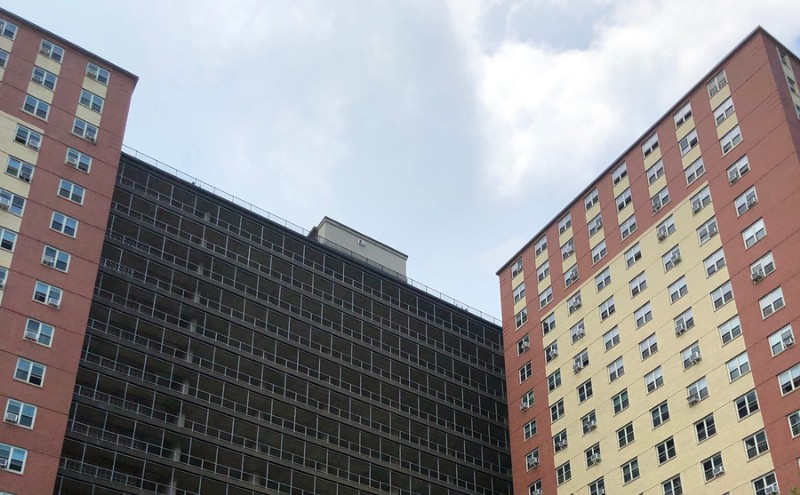
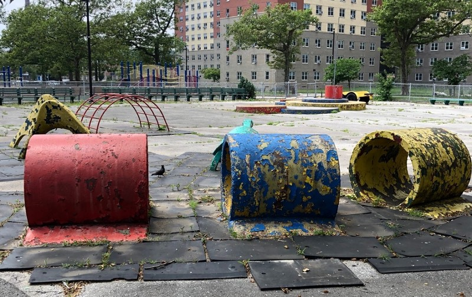

<!-----
title: The Time I Met a Family Friend Who Liked The Beatles
description: About the Time I Finally Met Someone Who My Family Knew Who Wasn’t Old
date: '2019-07-07T00:26:58.153Z'
slug: 5f7cb69edcd3
----->

One of the problems with being the child of old parents was nothing my parents did or liked was hip or cool.

I mean my mom and dad liked the Beatles but only in a “I heard them on the radio during work/shopping/walking around…” kind of way. Any hipness was coincidental. Otherwise it was simply absorbing what entertainment one could get via the Merv Griffin show or PBS. And by PBS I mean Sesame Street and the Boston Pops. Arthur Fiedler was the most famous orchestra conductor in my childhood home.

So anyway, trying to be cool as a kid was an awkward thing at best.

But I tried my best to be as “on trend” as a kid like me could be given the circumstances.

And one day, in Luna Park, I had a chance to be a bit hip and cool for once.

If the words “Luna Park” invoke imagery of moonlight magic and fun, it did… At one point. You see Luna Park is the name of a famous Coney Island amusement park that used to exist back in the heyday of Coney Island. It was one of the three original and iconic amusement parks to crop up on Coney Island at the turn of the 19th century.

But that was at the turn of the century. By the 1970s, the land Luna Park on was repurposed as affordable housing of some sort. Don’t ask me the specifics of what that “affordability” meant in the context of Luna Park. Don’t know and don’t care.

What what I did know about Luna Park was some family friends had gotten a place in Luna Park and this was a big deal. Unlike the crappy tenements most people my family knew lived in, Luna Park was relatively clean and modern. So we were all headed out to Luna Park to help these family friends move into their new place.

While the Luna Park apartment might have been cleaner and “nicer” it all seemed sterile and dead. The building had nicer lawns than our tenement, but nobody really did much with it or on it. It was just a huge patch of grass. While there were Yentas sitting outside the buildings like they did everywhere in the neighborhood, they didn’t seem as bothersome or intimidating sitting in front of those massive 20 story buildings. Heck, anyone could go in and out of those buildings via multiple entries/exits so you could avoid the Yentas altogether.

We walked through the bright — but dead — lobby into the shiny but dead elevators. For some reason the hallways in those buildings smelled like noodles. Say what you will about tenements, but at least the hallways in tenements didn’t smell like noodles.

When we got off the elevator we headed down the hallway and into the family friend’s apartment. It was bright, shag carpeted, pink walled and boring. Nothing to get excited about. But my parent’s friends were definitely excited.

They lead us all around the apartment and showed it off to us. Yeah, it was pretty empty and dead but we saw every room and was told what each of them would be.

At some point in met the son of the family friend’s. He wasn’t a kid, but a college-aged guy who was tall-ish, lanky and had a beard and big Jew-fro on his head. He was happy and goofy and I was happy to meet someone closer in age to me, even if that “closer” was still around 10 to 15 years older than me.

Soon it was time to go, and before we left their son decided to give me a little parting gift: It was a blow up toy version of Ringo Starr on a drum kit with the words “The Beatles” written on it. I was stunned and speechless! I’ve always gotten small gifts from friend of the family over the years, but I rarely got anything cool to hip. Or even Western. And that meant something to me. I was the son of poor elderly immigrants and I wanted to be Western. I wanted to be hip. I wanted to be normal.

We left and headed back home and I proudly held onto that inflatable Ringo Starr toy as if it was a gold medal or something.

A few weeks passed and I inherited my sister’s copy of _Sgt. Pepper’s Lonely Hearts Club Band_ when she left to get married and move to Indiana. I was so excited about getting that album I wanted to share it with that guy who gave me that Ringo Starr blow up; I mean I needed to share this cool score with the only other person I knew who would actually care about the Beatles, right?

I asked my dad if we could visit that family in Luna Park again. My dad stopped what he was doing, paused for a few noticeable beats and looked at my mom and said, “Not now,” and added, “Maybe another time, okay?” I had no idea what was happening, but knew it felt awkward but wasn’t something I would get a clear answer about. So I nodded and accepted that and didn’t mention it again.

Some time passed, then years passed and I just forgot about wanting to visit Luna Park.

Years later when I was older — around maybe ten years later when I was in Junior High School — I asked my dad about the guy in Luna Park again. I wasn’t still obsessed with sharing that I owned that Beatle’s album but just because the thought entered my mind. That’s when he told me what happened.

Back when I was a kid, when we visited them back then, they were just moving in. Their son was there to help them get settled and do some of the literal heavy lifting around the place.

A few days after we visited, their son was installing a window air conditioner on his own when his grip slipped and the air conditioner fell out of the window. Either he tried to stop it’s fall by grabbing the power cord, or the power cord got tangled around his legs but whatever the specifics were the end result was he was dragged out the window by the air conditioner and died.

That was about it.