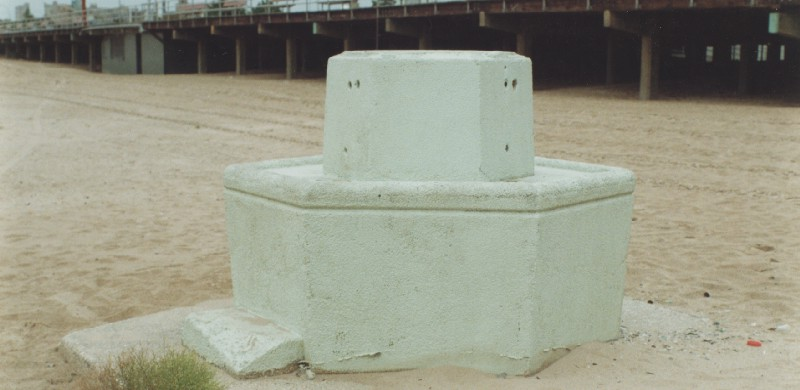

<!-----
title: Disco Freddy Hated Kids on Bikes
description: About Disco Freddy — a neighborhood character in Brighton a Beach — who hated kids on bikes.
date: '2019-12-29T06:09:53.036Z'
slug: 3119ca8ab564
----->

Everyone knows New York City was a dump in the 1970s and 1980s. But there were a few pluses — mixed in with all the minuses — to living in some neighborhoods at that time.

Like Brighton Beach had its share of pluses mixed in with all the minuses.

The thing about Brighton Beach in the 1970s and 1980s was as dumpy as the place was, you could still have a life if you had not much of anything.

You had a crappy boardwalk, but at least it was a boardwalk. You lived close to the beach, and even if it was a crappy beach, it was still a beach. The stores and shops in the neighborhood were all run down — and many were just straight out junk stores — but at least there was some quality stuff buried in these retail treasure caves if you put some effort into digging for them

Which meant a lot of people who might be down and out — or otherwise homeless and destitute — had lives they could lead as best as they could. Some just lead work-a-day lives as work-a-day citizens just coming and going as they pleased without bringing much — or any — attention to themselves at all. And some spent their days in this pseudo “Lower East Side by the Sea” as neighborhood characters.

Neighborhood characters were basically people you saw in the neighborhood all the time, who had some quirky schtick to them. You might never know them past seeing them on the street every now and then, and you might not even know their name past whatever quirky neighborhood nickname they adopted or was given to them by others. But everyone knew who they were and knew nothing about them as well.

Disco Freddy was one of those classic neighborhood characters.

Disco Freddy — who was also know as “Sensational” to some — showed up on the boardwalk fairly regularly in the late 1970s and early 1980s and was uniquely memorable among neighborhood characters. He was relatively young, clean and kinda looked like Kramer from _Seinfeld_; a tall and lanky hipster doofus. But he was more tan and lean; almost middle eastern looking with his slicked back Semitic hair. And on his own you wouldn’t really consider him too much of a character.

But when he was in performer mode, look out! As a “performer,” he would his regale the crowd with “amazing feats of strength and agility.” Feats of strength such as jumping over small sandwich sized paper bags and radios on the boardwalk.

Seriously.

The way pretty much everyone knew him was when he hung out on the boardwalk between Brighton 2nd Street and Brighton 4th Street and put on his memorable, yet “facacta,” act. It was a joke of a show at best, but it also wasn’t a joke at all.

I mean that description might sound harsh, but he would basically work up the crowd with his pushy — yet compelling — banter, rock back and forth, do some false starts and then… Finally… He would take a dramatically daring leap over his radio or a small paper bag of whatever. Sometimes we’d actually see him just walking down the street listening to his radio and dancing a bit. But this two-bit act was the way most of us remembered him.

There would always be a small circle of people gathered around and watching him. Mostly adults, the elderly and their caretakers and the occasional bunch of neighborhood kids. Disco Freddy was generally okay with kids… Unless they rode bikes. Then he’d flip out like an angry dog and chase any kid on a bike down the boardwalk. Sometimes he’d even throw bottles at the kids.

I know, because I was one of those neighborhood kids that got chased down. Usually I would just be riding my green Ross Apollo bike from Ocean Parkway up to 2nd Street, see the crowd and knew I had to slow down. I would roll by as close as I could, but if he saw me on that bike, he would go into an immediate defensive mode. He would literally stop what he was saying or doing, rock back and forth a bit and then — depending on his mood — either snap at me and other kids or get back into his “zone” before going on with his act.

If he snapped, I would pedal away as fast as I could. If he managed to keep his cool, I got to stand there and watch his act with everyone else.

On top of his act, he also had this little fat high functioning guy who was always listening to his radio that hung out and watched his act. When Disco Freddy was done, him and his little fat friend would walk back home to wherever they lived or hung out.

Nobody really knew what Disco Freddy’s deal was, but occasionally we’d hear rumors. Sightings of him walking around with, what we assumed was, his mom. But mostly if we didn’t see him performing his act, we saw him walking around the boardwalk with his little fat radio buddy. Just being people.