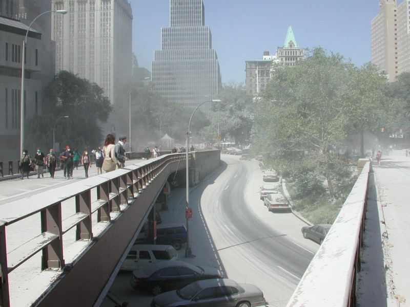

<!-----
title: 9–11 Memories
description: Recalling My Memories of Being in NYC during the 9–11 Attacks on the World Trade Center
date: '2021-09-12T17:32:40.526Z'
slug: ac0c03fb6fc5
----->

<!--The view from the Manhattan side of the Brooklyn Bridge around noon on 9–11. (Photo by Jack Szwergold; Taken September 11, 2001)-->

On the morning of 9–11 my phone rang. An actual old school rotary phone. I had a cell phone, but used that land line as my main number. I stayed in bed and let the answering machine pick it up.

A friend left me a message on my answering machine telling me something crazy happened and a plane crashed into the World Trade Center and I should turn on my TV to see it.

I flicked on my old school 20” CRT TV and saw the smoke coming out of one of the buildings. I stood and stared when another friend called; it was a former Onion colleague basically telling me the same thing.

We talked for a bit and then I hung up the phone and made breakfast. A few minutes after I sit down to gawk at the TV and watch the chaos, and another plane hits the other tower of the World Trade Center. I’m pretty much frozen.

Former Onion colleague calls me again and is basically rambling on about another plane hitting not being an accident. We talk some more and I eventually hung up.

I laid down on my sofa and watched the TV seemingly endlessly. The repeated footage of the planes crashed aired on and on on all channels. I eventually turned off the TV. And took a quick nap.

***

After the nap, I packed up my camera and walked down Atlantic Avenue (where I lived at the time) towards Brooklyn Heights. What struck me as odd wasn’t just a flood of people walking past me in the opposite direction. But normalcy in odd places.

Like a corner store in Brooklyn Heights with people going about their business as if nothing had happened with smoke literally wafting overhead outside.

I walked to the Brooklyn Heights Promenade. It was filled with people just staring at the smoke. I then decided to walk over the Brooklyn Bridge. I figured I knew friends and family who worked or went to school in Lower Manhattan so why not? Maybe I could help in some way?

I walked over the Brooklyn Bridge in the pedestrian walkway while the Brooklyn bound roadway below was filled with people walking back into Brooklyn. Some were covered in dust. Papers, dust and smoke filled the air.

When I got to the City Hall side, I was turned back by NYPD. Everyone was stunned. I couldn’t help, but I did take pictures.
