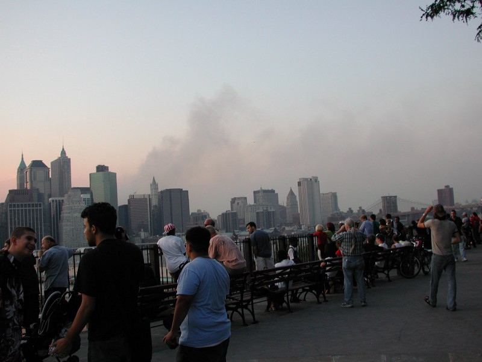

<!-----
title: 9–12 Memories
description: Recalling My Memories of Having Brunch With Ex-Onion Colleagues the Day After 9–11
date: '2021-09-12T17:39:08.439Z'
slug: dd2296a6a385
----->

The day after 9–11 was oddly calm and quiet. Everyone was in the same boat. Everyone was bonded in that crazy way only disaster could bring people together.

Around this time 20 years ago, I would’ve been on a Coney Island bound F train headed to 7th Ave. in Park Slope.

Former Onion colleagues who all lived around the same general area of 8th Ave. and 10th St. in Park Slope — and a couple in Windsor Terrace — were gathering for a morning after 9–11 brunch.

And I was invited to join them.

The brunch was at Dizzy’s Diner on 9th St. and 8th Ave. I got on the F train at Bergen St. near Boerum Hill, where I lived at the time, to head over.

The trains ran fine. The F train line ran nowhere near Lower Manhattan so it was not affected by anything related to 9–11.

I got on the F train and sat down. Maybe 4 or 5 people were in my car. We all sat there stunned in our own ways.

Right across from me was some subway poster for continuing education programs at NYU. People walking around Greenwich Village with the WTC in the background.

I stared at that poster and the bright morning sun coming through the Windows as the train emerged from Carroll St. and headed towards the Smith-9th St. station.

Then waited as the train headed to the 4th Ave.-9th St. station.

Then finally the 7th Ave. station.

Got off the train and strolled up 9th St. and headed inside.

The Onion crew had taken over the whole front table of the place.

Greetings were made and then the usual stuff that happens at group brunches like that happened: The menus, the ordering, the chatting.

One former colleague — who shall remain nameless — casually mentioned how his girlfriend was on an F train headed into Manhattan when a WTC tower collapsed and how she felt the train shake, the lights went on and off and they then the train moved on.

Utter bullshit.

First, the F train runs nowhere near the WTC site; it enters Manhattan past Canal St. at Rutgers St.

Second, the most immediate train lines affected by the WTC attack 1 and 9 trains directly below the WTC site and the R trains nearby.

So I called him out on it: I bluntly said the F train runs nowhere near the WTC site. He dead stared me, ate some food and then the conversation changed.

At some point I mentioned I tried to walk into Manhattan over the Brooklyn Bridge and brought my digital camera along.

The dude heard that, and blurted out, “So you walked over to take pictures?” It was said in a condescending tone that implied I was just there to take pictures as a novelty.

I let that just float in the air and let it fade away.

Yeah, I took pictures. But I also attempted to get into Manhattan because I knew friends and family might have been there and wanted to help if I could.

But this narcissistic psycho putz makes up a story so he can be directly connected to the horrors of 9–11? Eff him.

The Onion’s 9–11 coverage was justifiably praised as being a pitch perfect reaction to the events of the day.

But for me, it will always be scarred by this one pathological liar deciding to fabricate a false story to personally insert themselves into the 9–11 experience.