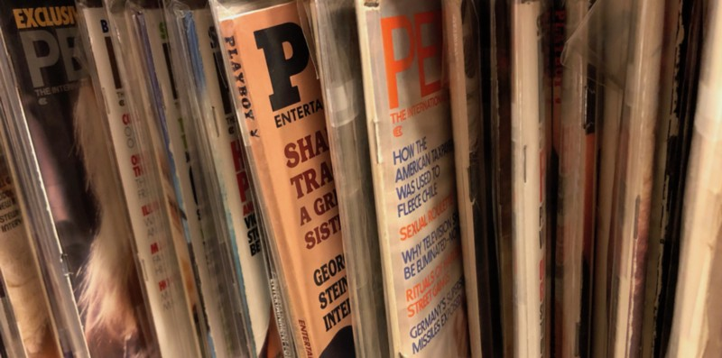

<!-----
title: Carlos the Cleaner Posed for Porn
description: >-
  About the Time a Guy at a Place I Worked at Showed us the Porn Pics he Posed
  For
date: '2019-08-05T00:16:10.502Z'
slug: a99fd04892e8
----->

One of the first jobs I had in late 1980s working for a comic book company called Castilian Communications. I was still in college — and wasn’t an artist or anything — but I was basically a “worker” working in the shipping department, taking orders, doing data entry, and all that. General small company office bullshit.

And the company itself wasn’t really some big formal business, but rather it was a boutique business that was run out of a residential loft on 19th Street near Park Avenue South in the Flatiron district. One half of the loft was a Spanish illustration agency and the other half was a graphic novel business. The two guys who ran the both business lived in the back of the loft itself.

I got hooked up with the gig after blinding writing for a summer job at another boutique comic book publisher called Roar Books. They were well known and well regarded and one of the main guys at Roar Books gained some fame writing a comic book about his family’s experience during the Holocaust. Knowing that — and seeing similarities between his family’s Holocaust experience and mine — I wrote to them, explained my interest in comics as well as my family’s connection to the Holocaust, and basically asked them for a summer job. They responded positively — it seemed — and I got what I was led to believe was a job at the place.

But the supposed “job” turned out to be just a shitty internship doing things I wasn’t really interested in for barely any salary whatsoever. I had to basically sit around in this SoHo loft all day like some servant on call to do… Whatever… Whenever they decided I could do things like lift boxes or file papers. Yeah, as an adult now I understand the value of a real internship at a place you can feel a career connection to. But back then I just wanted a job at a place that didn’t exactly have to be cool, but was at least somewhat fun to spend time in and — most of all — to get paid in the process.

Which is all to say in the case of Roar Books, I generally didn’t get along with anyone there and didn’t find being there to be a positive experience at all. Especially when the main gofer/“toadie” at the place — this guy named Rob — would endlessly put off paying me every week as he promised. It was my first introduction to the art and publishing world — and the endless excuse of non-payment — but I wasn’t really ready for it then.

So after a few weeks of making maybe $80 total for my efforts, Rob called me and said — in this really passive aggressive way — that there was a job more up my alley at this place called Castilian Communications. I never heard of them before, but it sounded more like a real job with real responsibilities and real pay. So I called Castilian Communications up, met the owner and — although he was a bit odd in his own way — we got along better than I did with the folks at Roar Books and I ended up getting decent summer job in “the city.”

So anyway, the job at Castilian Communications was pretty cool for a lightweight summer job. I unloaded trucks, filled orders, responded to customer inquiries/complaints, went to the bank, went to the post office and all of that stuff.

But the thing is the place wasn’t really an office or a real workplace. It was like a huge home office that I happened to work in so things got oddly casual — and weird — at times.

Like whenever Carlos — the cleaning guy — would do pretty much anything in the office.

Carlos was a NYC born and bred Puerto Rican guy and proud of it. He was short, wore a cap with the Puerto Rican flag on it and had a huge mustache that made him look exactly like John Oates from _Hall and Oates_. He was cool, but he’d needle, harangue and pester you a bit just for fun. And he liked pick on me a lot because — as some deep Brooklyn white guy working in “the city” — I was kind of a “redneck” compared to them.

But every once in a while — seemingly out of the blue — Carlos would cook a meal for us. And when he cooked for us, that was an all day affair.

On days like that, I would get in at 10:00am and he would already be cooking a huge pot of rice, beans and chicken. The rice was done quickly and would just sit there. The beans and chicken? He’d babysit them all day so he could serve it to us around 4:00pm or 5:00pm.

“You’re gonna like it, Jack,” he’d say to me. “It tastes better than pussy Jack. I assure you,” he’d add.

Some days I just smiled and ignored it. Just humoring him and nodding in agreement as I walked around the office to let it pass as quickly as possible. Other days I would outright avoid him which was surprisingly easy given the size and layout of the loft. In general, I was cool with it — as a form of basic hazing — as long as I could somehow get so space away from it when I could.

Then when the time came for him to serve the food, he would double down on reminding me that the chicken tasted better than pussy by repeatedly saying “Jack, you’re gonna love it. It tastes better than pussy, believe me!”

And you know what? The chicken tasted really good. Was it better than pussy? That’s not really a comparison that properly respects chicken or pussy in a fair and even-handed way. But I will say this… It was definitely some decent chicken.

Then one day after one of these meals, Carlos got into one of his verbally violent and sporadic fights with the head guy at Castilian Communications. I think it was over pay, work or something like that. Maybe money owed for other stuff he did on the side for him? Who knows. But when these fights happened, we all cleared out and headed back to our humble little desk area and pretended to ignore it as much as possible.

And that’s where we waited for Carlos’ post fight co-worker venting to happen.

What would happen is Carlos and the boss would fight. The boss would go off somewhere and Carlos would then be flustered, paced back and forth around the office and then would come back to our humble little desk area to vent.

“He’s bullshit man!” he would say. “I do a ton of work here and he treats me like shit,” he would add. “I’m gonna quit, man, and let him learn,” and so on and so on.

This was all painful yet predictable and would usually blow over in 10 to 15 minutes like a passing storm. But when it happened at the end of the day — when everyone was trying to get work done and head home — it was extra annoying. Nobody wanted to leave in the middle of one of his rants and somehow — inadvertently — disrespect him; that would just stretch the bullshit on even longer. And we all just wanted to go home after eating that delicious “better than pussy” chicken he made for us and just not think about work anyway.

But this time he added something new to his rant, “You know, I was famous once. I posed for porn!” Which was a new one so we all instantly said, “Really?” and he responded, “You don’t believe me? I did!”

Somehow he interpreted us questioning his porn career as some kind of personal slight. “Really? Really?!? That is what you think?” he would say all nervous and indignant. “Well fuck you! Fuck you Jack! Fuck you Miguel! Fuck you Shannon! Fuck you Vinnie!” he screamed at us. “Just you wait! I’ll show you!” he said as he stormed off all red faced and upset. When he got to the elevator he shouted a final “Fuck you!” to all of us as he headed out.

We all looked at each other — stunned and shocked — and then chatted a bit about what just happened with Carlos and then all headed home.

The next day I came in a little late, but when I arrived it seemed like another boring day at the boutique loft office when suddenly Miguel — laughing nervously — said to me, “Jack, Carlos brought in one of the porn magazines he was in.”

As I put down my bag I said, “Really?” and with that Miguel turned around and passed me a manilla office folder. I opened it up and inside of it was some kind of low-rent male porno mag — _Cavalier_ or something like that — and there on the cover was a shirtless, hairy, ripped, glistening and sweaty Carlos in all of his natural glory. His jeans were unzipped at the tope, but that was about all one could see on the cover.

“Wow!” I said, as I closed the folder up again and passed it back to Miguel. “No! No! Jack you are missing the best part,” he said as he opened it up, flipped some pages and passed it back to me.

As I took the magazine in my hand, I looked at the page Miguel opened it to and there was a full spread featuring Carlos. And wow, the guy was hung like a horse.

“It’s like down to his knee!?!” I said as I looked at it.

“Yup!” Miguel said.

I stared at it a bit and looked around and asked “Where’s Carlos?” Miguel responded “He’s running some errands. But we can’t let the boss see it.”

It wasn’t like the boss was homophobic or a prude or anything — far from either to be honest — but Carlos just never let the boss see any of the shots from his brief stint as a male porn model. It was some weird unwritten rule about their relationship I guess.

So with that I passed the magazine back to to Miguel who slipped it back into the pile of stuff on the shelf behind him and we all got back to doing whatever we were doing that day.
