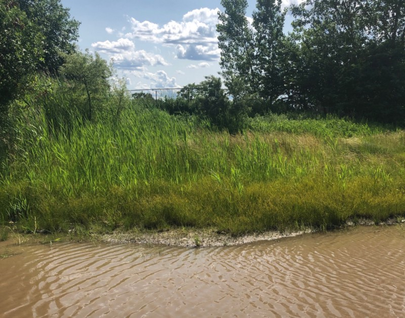

<!-----
title: Drowned Car Near Nellie Bly
description: About the Time My Brother to Drowned His Car Down the Road from Nellie Bly in Gravesend
date: '2019-07-01T02:52:00.233Z'
slug: 4da44bb4b6c2
----->

It was the summer. Not too sure what day it was or what time of the summer it was, but my brother was around and wanted to take me out to have some “fun.” This kind of stuff was tedious and a bit pandering but it was undoubtedly predictable. The summer was around and my brother was making one of his, “Check in With the Family” visits and — invariably — I would somehow be dragged into one of his hare-brained schemes to have “fun” with me.

You see, my parents were older, the neighbor I lived in was a dump, and my brother also liked projecting his parent-child insecurities straight onto me. I mean he was 20 years older than me and my parents were old enough to be considered grandparents, so he followed his most cynical, “what would the community think” instincts and decided dragging me around was some kind of mitzvah, some kind of good deed that would help me no matter how hamfisted his efforts were.

So dragging me around to do something “fun” was something he liked to do.

When he asked me where we could go it was always a loaded question at best: If he read about something in _New York_ magazine or heard about something on WNYC that was vaguely “kid friendly” lord knows I would be cajoled into going along with it no matter what.

So with that in mind, after a pregnant pause and a noticeable heaving and a sigh I said, “Nellie Bly… Let’s go to Nellie Bly.” His face screwed up a bit and he blurted out, “What is this?” and added a “Why should I go there?” As his face reddened I braced myself and said, “It’s an amusement park with miniature golf. I want to play some miniature golf.”

He stopped for a bit, looked around, grabbed a phone book and looked it up.

“Okay… Okay… This looks good,” he said as he figured out where it was located. “Let’s go!” he said which felt like a minor victory. I was able to get him to do something I liked without a major fight.

“Great!” I said. “I’ll go get my money,” I added to which he snapped back, “You don’t need that! I can pay!” That started a minor fight when my dad heard that and started to scream at my brother that I could do whatever I wanted with my money. That fight lasted a minute at best, but it was enough time for me to open up the mini-safe/bank I had on my desk, take out some dollar bills and change and head out the front door.

My brother followed shouting “Wait!” as I headed down the staircase and into the sunny day that was awaiting outside on Ocean Parkway.

The usual bunch of aging neighborhood Yentas and kids were outside the building doing whatever they were doing. I quickly waved at whoever I knew and ran over to wherever my brother’s junky car was parked and waited for him to show up.

When he did show up he chastised me for running out ahead of him while he was fighting with dad, but I was’t worried. He seemed out of breath and in a better mood after fighting with our dad.

He opened up the passenger side door and I leaned over to unlock the driver’s side door. “You don’t have to do that,” he said as he opened the door and got into the car himself. I just shrugged, put on my seatbelt and got ready for the ride down the Belt Parkway to the armpit of Gravesend that Nellie Bly was located in.

Nellie Bly was a weird amusement park that was not easily walkable even if you lived near it. It was located on the side of a service road nobody really drove down near the edge of New York Harbor. Years later I discovered it was formerly the site of a construction company. When the owner of the place got tired of the construction business, he decided to use the land to create a small amusement park. And while it was considered a kiddie park, it still had some cool rides adults could enjoy as well as some cool arcade games and such.

But I didn’t care about that stuff. I lived near Coney Island and could ride rides and play games whenever. I wanted to play miniature golf.

After a short drive, we arrived at Nellie Bly. It was kinda dead, but there were still some people around. My brother was kind of impressed with the place. It was quiet and small and because of it’s relative isolation from the rest of Brooklyn it felt like we really took a trip away from “the city.”

We went in, I putzed around the arcade a bit and then we headed to the miniature golf course. I was impressed by it. It had all the things a miniature golf course needed to be cool: Small greens, cool traps and tricks and a few cool kitschy obstacles.

Playing miniature golf with my brother was genuinely fun. No kidding. For some reason on that day he was balanced and normal when we played: Competitive, but not toxic. Fun but not condescending. It was weird but cool.

After a while, we both finished the course and neither one of us got a golf ball in the clown’s mouth — to win something cool — so the game was officially over.

We both grabbed a soda from a concession stand, got back in the car and got ready to go back home.

As we pulled out of the parking lot and onto Shore Parkway, he flicked the blinkers on to make a right. I knew that was a problem and said so.

“Why?” he stated indignantly. And I explained that a week or so earlier when I was riding along with my sister and we were driving down Shore Parkway, the road was flooded and no cars could pass so we had to backtrack to get around it.

“Bullshit!” he shouted at me. “How deep was that water?” he added. I shrugged and said no cars could pass. But he drove on without worries.

Then we saw it: Deeply flooded out road. Was it from rain or a pipe breaking or even a fire hydrant? Who knew. We knew it was deep. Deep enough that there was a small group of neighborhood kids sitting on the huge unpaved dirt pile on the side of the road entertaining themselves by throwing rocks and bottles into the stagnant, dirty water.

My brother stopped the car near the edge of the water while some other cars behind us backed up and mad improvised U-turns to head out of that mess.

So my brother saw everyone leaving, looked ahead at this huge flooded out lake of a roadway and decided, “This is no big deal.”

I meekly asked, “Are you sure?” To which he responded, “Don’t be stupid.” And with that he eased up on the brake, pushed down on the gas pedal and headed into the water.

Water splashed all over and we made it about half way before his engine died: It was flooded with water.

He tried to start up the car again, but it wasn’t going anywhere. That was bad, but what was worse is water started to leak in from the floor of the car and the bottom edges of the closed doors.

“Look!” I said pointing to the water leaking in. My brother then repeated his mantra, “It’s no big deal.” And added, “Go outside.”

I looked outside and could see water all around us and those kids by the side of the road looking down at us with a mixture of laughter and concern. I opened the door and stepped out into the brackish brown water.

I waded for a bit but then just started spontaneously crying about the whole situation. I climbed up on the side of the road where those kids were, and turned around to see my brother outside of the car and pushing it down the road. My sneakers were soaked so I took them — and my socks off — stood up and started to walk down the road.

“Be careful!” one of the kids shouted, “There’s glass all over!” And he was right. The side of the road was essentially a sandy, weed filled hill. Broken bits of glass from bottles and such were all over the place. But it wasn’t too bad if you walked lightly and watched where you stepped. Which is a what I did.

The equivalent of a half a block to so later, I was on solid pavement again. The soles of my feet burned a bit from the summer heat of the cement and asphalt, but it wasn’t too bad.

And by the time I got there my brother had finally pushed his car out of the water.

I got into the passenger side of the car, pulled out a towel and sat there with the door open to wait and see what would happen next. My brother had the hood of the car up and was looking around to see if he could do anything to start it up again. All the while he was yelling about this, that and the other but never once admitting that his idea to just drive through the water was a good idea at all.

I honestly don’t remember how he started the car up again since I blocked that stuff out of my mind. Maybe he fixed it on his own? Or got AAA to help? Or got help from a nearby gas station or something? Who knows. But I do know that within an hour or so the car was damp, but running again as we headed down the Belt Parkway and headed back home to Ocean Parkway.

As I headed into our apartment, my dad knew something was up because my jeans were dirty, and I was barefoot and holding my sneakers and socks in my hand.

“What happened?” my dad asked. “Talk to Ben,” I said as I headed into my room to change and get dry.

As my brother headed inside, my dad and him started to pretty much immediately shout at each other in Polish, Yiddish, Hebrew or whatever. In had no idea of the specifics past what I knew had happened: My brother drove his car into a flooded roadway and pretty much ruined what might have been a really nice afternoon of simple fun.

I do know one thing: As the fighting continued, my brother did blurt out, “It’s no big deal!” at least once or twice before he headed out back to his place in Washington Heights.
