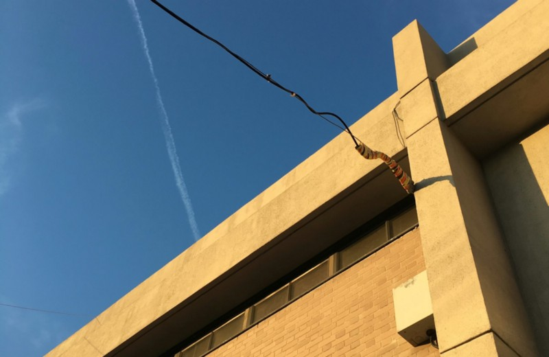

<!-----
title: Fire in the Wood Shop
description: About the Time Something Caught on Fire in the Wood Shop in Junior High School
date: '2021-05-24T01:46:46.540Z'
slug: d1ec9ffb9bd3
----->

<!--A photo of East 14th Side of James J. Reynolds JHS. (Photo by Jack Szwergold; Taken June 19, 2016)-->

It was a bright, sunny, spring-ish day in 1983 in Sheepshead Bay and I was working as a student aide in some school office in James J. Reynolds JHS. Filing, running errands, opening mail, etc… Basic office bullshit like that. I did that kind of work because what else could I do to kill free time other than be some kind of lackey for my last year on junior high.

One day I was putzing around, not doing much of anything but waiting for lunch to end so I could head back to class when I smelled something burning. Not exactly an objectionable smell, but a smell none-the-less. Smelled like wood, but there was no fireplace in the building.

I walked out of the office, literally sniffed around some more, then turned to the right and saw a bit of a Smokey haze floating down the hallway. The hallways were empty since everyone was literally out to lunch. It seemed like I was the only one on the floor let alone the building itself. I walked down to the main corridor and then looked down the hallway; there was tons of smoke down near where the wood shops were.

I started to walk towards them, but the smoke was getting thicker and stronger and that is when I heard someone, somewhere beyond the smoke shout, “Fire!” That’s when I ran back down the hall to the office.

As I stood there I heard a faint rumbling in one of the stairwells. Nothing distinct or discernible but just the sound of people clamoring about somewhere in the stairwell. So I walked over, pushed the door in and went in.

As I took a step inside, people from upstairs ran down past me; some jumping down 2–3 steps at a time. But they weren’t the source of the commotion; down the stairs the noise was louder and more incomprehensible. I walked down the stairs to the next landing and saying it was a mob scene would be an understatement to say the least; it’s was just tons of panicked junior high school kids packed like sardines trying to push their way out the side doors. Both of the doors were swung open, but the crowd was just too big and panicked and were effectively crammed in.

I waited on the landing a short while hoping for the crowd to get smaller, but it never happened. So I ran back up the stairs, ran past the smoky hallway and ran across the building to the stairwell that lead to the main exit of the building.

I had no problem jumping down the stairs in bunches two or three at a time and hit the ground floor near the main entrance in less than a minute or so.

But when I got there it was pretty desolate; the school security guards were gone and the front doors were wide open. The sun was pouring in as sounds of fire engines echoed through the streets outside.

I jogged out the front door and saw some teachers, staff and security mingling around, waved at them, and then saw friends and classmates gathered across the street near Sheepshead Bay itself. I waved at them, they waved back, and then sprinted across Emmons Avenue to meet up with them.

The second I hit the pavement on the other side someone shouted “Let’s cut!” “Cut to where?” I said, “All of our stuff is in the school.” We all shrugged in agreement and just casually walked down the way to the rickety bridge around Sheepshead Bay Road.

Everyone gossiped about what all mutually knew little about.

“Didya see the fire?”

“Wonder if they’re gonna close the school?”

“I heard some kid got hurt running away from the fire!”

The usual uninformed nonsense a bunch of dense teens would say.

After some time passed, a good sized chunk of the school’s students were all gathered around the same area. And soon enough, teachers and other school staff came by to round us all up.

Soon enough we all self-organized into groups based on our mutual home rooms and such. The gossipy teenage bullshitting continued until someone pointed out Mr. Pearl, the Vice Principal of the school, was running down the street. It was kinda a hilarious sight to see to be honest: He was overweight, balding, wore cheap department store suits and kinda looked like a Brooklyn version of Mr. Weatherby from the _Archie_ comics.

Anyway, we all started laughing at him. And it wasn’t subtle at all; lots of finger pointing and loud laughs punctuated by the occasional, “Oh my God!” or “Holy shit!” I mean he ran in such a lumbering and useless way, it was hard not to laugh; he could have just walked briskly and covered the same distance at the same speed. It was all fun and games until Mr. Pearl turned at us and clearly glowered our way, and in my case, glowered at me directly. I mean I was a student aide and interacted with him, so he knew who I was and could see what I was doing.

Some teacher or guidance counselor came by and told us to tone it down. So we did. But you could tell we were all mentally tagged as “trouble” at that moment.

After about 20 to 30 minutes or so, we were all led back to the school and all headed back to our home rooms.

In my case I had to make a slight detour back to the office I worked in as a student aide… Which also happened to be… Mr. Pearl’s office.

I slunk inside to grab my stuff, and he was sitting at his desk and on the phone with someone clearly talking about the fire. He looked at me and waved goodbye, but clearly had a slight glower in his face.

I waived back and headed out.

The next day we all found out the fire was caused by someone leaving a soldering plugged in on some scrap wood on a table. So the fire wasn’t that bad and didn’t destroy much of anything. The school would not close and nobody was hospitalized.

Around lunch time I headed to the office to do my student aide work. Mr. Pearl greeted me: He was smiling and cheerily said, “Jack!” which meant I was in for something.

He grabbed a small bucket, sponge and a can of cleanser and led me to a door to a classroom down the hallway.

“Okay Jack, today I want you to scrub the graffiti off of this door. The door in question was metal, painted beige and had a healthy amount of black magic marker tags on it.

He filled the bucket with some water from a nearby water fountain, put the sponge in the water, shook some cleanser on it and told me to go ahead and do it.

I sheepishly took the sponge and started to scrub the door. Not much graffiti was coming off of it. “Look,” I said to him, “It’s barely cleaning it.”

“Oh, just lean into it a bit, Jack,” he said with a smile as he grabbed the sponge and demonstrated himself. And you know what? I you really leaned into it, the graffiti came off.

So with that said and done, he left and I started scrubbing the door.

A few minutes passed and some kid from one of the special ed. classes walked by, leaned down and asked me what I was doing.

“Why you doing that? You get in trouble or something?” he asked. And I responded, “Yeah, I guess I did.” To which he responded to in a high pitched laugh.

He stood up, still laughing and walked away as I continued to scrub the door.

The next day I got to school early and hung outside with some friends. One of them, Alex casually said he had seen the smoke and fire in the wood shop when it happened.

I turned to him and asked, “So why didn’t you pull the fire alarm?” His response was, “I didn’t want to get in trouble.”
