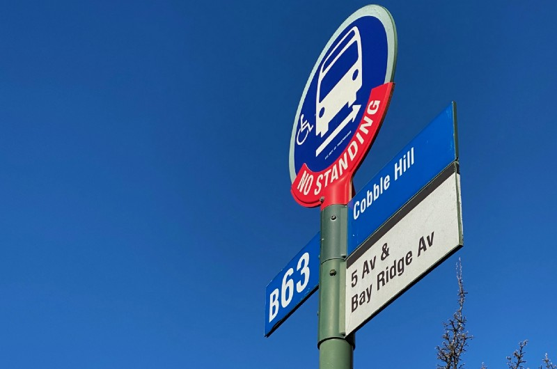

<!-----
title: Friendly Teenaged High-Functioning Girl
description: About the time I was waiting for the bus in 2017 or so.
date: '2020-01-21T01:59:24.438Z'
slug: f0da1beab207
----->

<!--The bus stop signage where the events in this story happened. (Photo by Jack Szwergold; Taken January 20, 2020)-->

She ran across the street to the bus stop to meet someone at the bus stop. That person looked like an older version than her.

They waited together until the bus came. And then somehow I got mixed up and was standing between them. The older person is in front of me and though I was her friend and shouts to me as if I was her, “Can you take out your fucking card so we don’t have to fucking wait on the bus like we always do.”

When she finishes the sentence, she turns around to look at me and says, “Sorry!”

Then the younger girl taps me on the shoulder and says, “Can I go I front of you?” I say yes and she does.

On the bus the younger girl is completely fascinated with the rain coming down. It’s a downpour and the streets are instantly flooded. “Wow!” she keeps on saying as the bus drives along.
