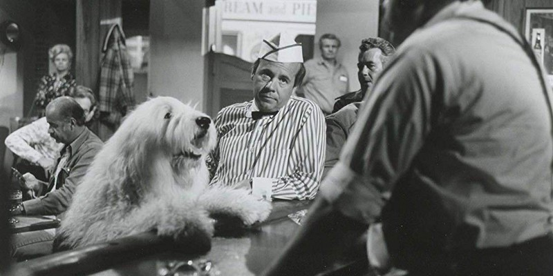

<!-----
title: Going to See “The Shaggy D.A.” in Times Square in the 1970s with My Dad
description: About the Time I Went to See “The Shaggy D.A.” with My Dad in Times Square and Got to Meet Goofy
date: '2019-01-22T03:31:29.347Z'
slug: dc96237e490f
----->

<!--Tim Conway and a dog at a bar in the 1976 Disney classic, “The Shaggy D.A.” (Promotional still from the film as found on IMDb)-->

I really liked reading the Sunday newspaper in the 1970s. And by “reading” I mean “flipping through.” And by “Sunday newspaper” I mean _The New York Daily News_. _The Daily News_ was the only newspaper in our home back in the 1970s.

At least it was the only newspaper on the days my dad could get it. On those rare days my dad decided to buy it later in the day — and by then it was sold out — he would just grab a copy of _The New York Post_ as a stop-gap measure… But none of that is neither here nor there.

On Sundays in our home it was the Sunday _Daily News_ and not much else. And I‘m not complaining!

I typically would scour through the comics and colorful sales circulars to squeeze some entertainment out of that pile of newsprint. The comics sated my need for colorful pictures and corny jokes while the sales circulars filled my head with the dreams of things (mostly toys) I might — and might not — be able to afford with my meager childhood allowances.

But sometimes I would flip through the movie section to see what movies were coming out. And looking through movie ads in a working class newspaper like the _Daily News_ back then was a weird experience for a kid.

While there technically was an MPAA movie ratings system in place at the time, that was mainly to control who could see movies in a theater. It didn’t really cover where ads were actually placed in newspapers. And ads for movies of all kinds seemed to be placed arbitrarily at best in newspapers back then. Sometimes ads for G rated films were placed right next to more adult oriented PG or R rated films… And sometimes even next to X rated films!

As a 7 year old kid, most of the films out at the time didn’t really appeal to me. I liked cartoons and other short attention span — and many literally short — ephemeral stuff you could catch on TV. So movies always seemed like more of an adult thing to me anyway.

But on that specific Sunday I saw an ad for a movie that blew my mind: It was for “The Shaggy D.A.!” I had no idea what the movie was about didn’t care because two key things grabbed my attention: One, this was a movie that featured a dog as a lawyer and two, this particular screening of the movie in Times Square would give me the opportunity to meet Goofy in person! My mind was blown! I had to see this movie!

I ran over to my dad and enthusiastically showed him the ad, “I want to see this movie!” I said as I pointed my tiny newsprint covered fingers to the ad for “The Shaggy D.A.” that had a special appearance by Goofy.

My dad wasn’t incredulous, dismissive, exasperated or patronizing but took my request seriously. He lifted up the paper, looked at the ad and said “So this is next weekend, right?” he said. “So we’ll go then, okay?” he added and I nodded.

He put down the newspaper on the living room coffee table, circled the ad with a blue ballpoint pen and gave the movie section back to me.

I was thrilled and happy as I looked at the ad with the fresh circle of blue ink around it.

A week passed and we were ready to head into “The City” (aka: Manhattan) to see “The Shaggy D.A.” It was an overcast — and somewhat dreary — winter day and the D train ride to Times Square was kinda quiet, calm and uneventful.

We got off at Times Square and — as typical — I was enthralled an confused by all of the lights, dirt, grime and general disrepair of the area at the time. On the one hand, there was an array of oddball arcades and entertainment around that sort of reminded me of Coney Island… But nowhere near as kid friendly as Coney Island was even back then. But for a small 7 year old kid — even a kid who was from a crappy neighborhood himself — this was a somewhat scary place. So I made sure to hold my dad’s hand as we made our way through the streets of Times Square and headed to the movie theater.

The theater itself was truly a dumpy black-box of a theater; as an adult I might call it a “grind house” but back then it was simply a dump.

While it was in some ways similar to the dumpy neighborhood theaters I had seen in my then short life so far in deep Brooklyn, those were mainly just theaters that were worn, on their last legs and slightly neglected due to age and lack of funds for adequate upkeep.

In contrast this dumpy Times Square theater seemed be actively beat up and vandalized on a regular basis as a part of normal business. But as dumpy and dingy as it was, I didn’t feel unsafe there; just unimpressed that this would be the place where I would meet the legendary Goofy himself in person.

After buying tickets at the beat up box office, my dad and I walked in, found some seats and got ready to watch the film. A quick glance around the place showed that the makeup of the audience was a similar array of parents and kids scattered all over the place for the same reason: To see the film and to meet the legendary Goofy in person.

That said, it wasn’t clear whether Goofy would come out before or after the film. So we all sat and waited. And then — with little to no fanfare — the film began. And you know what? It really stunk. I have no idea to this day what the plot was but will say this: The second the dog lawyer appeared on the screen, I was totally into it. And when that dog lawyer was nowhere to be seen? I didn’t care. And since the film was filled with too many scenes that didn’t have a dog lawyer doing something on screen, I couldn’t wait for the film to end.

And when that turd of a film ended, I was relieved. The lights came up and someone up front in an official looking usher outfit basically announced that Goofy was here to greet people. And all the kids pretty much got excited at the same time and stood up in anticipation of his arrival.

Soon enough there he was! Goofy himself enthusiastically running up the aisle, adjusting his “head” with his big, white Goofy gloves every few seconds. I don’t recall Goofy or his entourage giving out any cool promotional swag to his fans — like some keychains, stickers, pamphlets or something like that — but he mainly just walked around, greeted fans and was kind enough to stop and pose for pictures as well.

My dad didn’t have a camera back then, so we just waited patiently near the edge of the aisle for Goofy to come by and shake our hands with his big, white gloved hand.

Without much warning, Goofy came close to me, grabbed my hand and shook it pretty violently. I mean I was a 7 year old kid at the time and felt the heavy wave of the shake all the way up my arm and up to my shoulder. He shook my dad’s hand as well and — to my dad’s credit — he feigned genuine excitement when he exclaimed with kind-hearted, calculated dad-joy that he had just met Goofy.

And as quickly and suddenly as he appeared, Goofy ran up the aisle and disappeared out the main doors of the theater. And soon enough the rest of us followed his lead and headed out onto the streets of Times Square.

Walking back to the subway after meeting Goofy — and seeing that crappy film — was just as creepy and odd as it was walking to the theater; except this time we were leaving. We passed Nathan’s and my dad asked if I was hungry and I shook my head “No!” and with that we headed back to the D train and back home to Brighton Beach.
