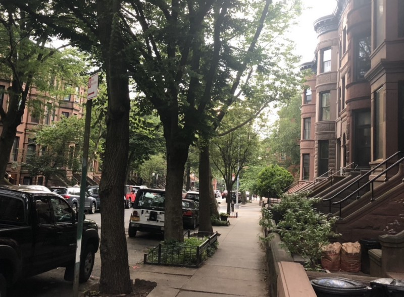

<!-----
title: Going to a Slopie Party in the 1980s
description: About The Time I Went with Friends to a Party in Park Slope in the 1980s
date: '2019-06-17T02:52:44.303Z'
slug: 527739b215e9
----->

<!--A view down a Park Slope street. (Photo by Jack Szwergold; Taken June 16, 2019)-->

PerIt was sometime in the 1980s. I want to say 1984 or 1985 since I was in high school and I heard about this party from neighborhood friends of mine who were going to Midwood High School. Midwood was kinda the yuppie “magnet” high school in Brooklyn. I went to Abraham Lincoln High School where all the non-special, non-magnetized students went to.

While Lincoln was a high school that had a well mixed population of kids from Brooklyn that came from all kinds of ethnic and economic backgrounds, Midwood was the closest thing to a “preppie” high school in the New York City education system that I knew of. Everyone who went to Midwood was well-to-do in some way; either blatantly rich or somewhat on the spectrum of “crunchy granola” entitlement. And I — with my working class, first generation American background — was definitely an outsider to that world.

The main reason I knew about this party — and that whole Midwood High School crowd — was because some neighborhood friends of mine from Junior High School happened to luck out and get into Midwood. We were still friends, but they — despite their qualifying to go to Midwood — were still somehow outsiders to the Midwood social scene themselves.

Social, geographic and economic stratification was happening… But we weren’t all aware of it yet… Or were at least in some level of delusional denial or something. Whatever… We were still friends despite the social school rifts and divisions that existed.

So anyway, one weekend I get a call from one of my friends. I thought he was calling to do our usual teenage weekend thing of going to local video rental store, scoring a movie of some kind, scoring some kind of alcohol and snacks of some kind and just hanging out and watching a movie and getting drunk. Instead he told me that he got invited to a “Slopie” party and I should come along.

“Slopie?” I asked — never hearing that slang before — and he responded, “Yeah, some kids who live in Park Slope. They have their whole brownstone to themselves.” I barely knew what a brownstone was at the time, but didn’t ask; all I knew it was an expensive home of some kind in a part of Brooklyn far away from Brighton Beach so this was no apartment party… It was a house party of some kind and I was into it.

So with that, I headed outside to hang out in front of the building on Ocean Parkway and wait for my ride. Which was always awkward at best.

***

You see, while other buildings had actual security systems, doormen and even dogs, our building had a classic Brighton Beach improvised security system: A bunch of old gossipy Yentas just sitting outside on their folding chairs watching the world pass by. They sat around, had some fresh air, gossiped — and judged others — in Yiddish and stood (sat?) watch.

And while I have some nostalgia for those Yentas, it was all kind of excruciating to be honest.

“Where are you going?” some would ask.

“Why don’t you go home?” others would insist.

“Your parents worry about you…” others would state.

In general if you spent more than 5 minutes in front of any building in Brighton Beach, the Yentas would start barking needling, meddling and gossipy bullshit at you. Not for any reason other than that’s all they could do to interact with humans younger than them at that stage of their lives.

And just as the Yenta bullshit was about to creep completely under my skin, my friends pulled up in someone’s dad’s car and honked for me.

I ran over, opened the back door, jumped in and we headed up Ocean Parkway, onto the Belt Parkway and up to Park Slope.

I leaned over from the backseat and, “So who’s party is this?” And my friends looked at each other, looked at me, shrugged and said, “Someone…” Turned out this was some kind of generic party that people in certain circles at Midwood High School somehow knew about. And we may or may not be crashing said party, but whatever. It was a house party so who cared; we’d blend in, right?

Anyway, this was my first house party so I had unrealistic expectations to say the least. I mean, I had been to parties before but in the case of this house party, I had some silly fantasies of what that might mean. I pictured multiple floors of active partying happening. Kinda like what a that house party in “Pretty in Pink” was like, but less suburban.

At least that’s what I hoped for.

As we turned onto one of the streets in Park Slope I looked around for obvious signs of a party. None could really be found; just trees and Brownstones and trees and Brownstones and no signs of life. After a short while the car slowed down as we approached the building where we knew the party was happening and there I finally saw some life: Two kids in jeans and sandals with socks on them were hanging out on the stoop.

“This is it,” a friend said. And with that done, me and the friend — who wasn’t driving — jumped out while my other friend who was driving went to park the car.

“Hey,” I said to the kids sitting on the stoop. They said hey back, both looked at each other and then one bluntly said, “You don’t go to Midwood, right?” I looked at my friend and said, “Nope. I go to Lincoln.” And the kids on the stoop looked at each other and one of them said, “Lincoln?” And after a pregnant pause added, “I think my dad went to Lincoln.” And with that one of them passed a joint to the other person. Me and my friend stood there, waiting for it to be passed onto us but that never happened.

And then — without a word spoken between us — we headed inside the Brownstone to see what the party was all about.

As we walked into the place nothing seemed dour or negative, but not much seemed to be happening that could be considered a “party” in any way. It all seemed dead. There was literally just a lone bowl of chips sitting next to a lone bowl of some pretzels and a small cooler with a humble amount of beer — and maybe a wine bottle — in it and not much else.

Some people were sitting around on a nearby couch and there were a few others on the stairs. Some music was playing, but it wasn’t too loud or anything too great. A guy was sitting on the stairs either tuning or playing an acoustic guitar if that could be considered anything.

“Well, I guess this is it,” I said to my friend. We then both looked around and shrugged and decided to see what was happening upstairs.

As we walked towards the stairs the guitar guy on the steps blocked us and said, “Can’t go up there. Nothing is happening up there.” And with that we headed over to the bowls of chips and pretzels, grabbed a beer and just stood around.

***

After a while my other friend — who was parking the car — showed up. “So what’s happening?” And we all looked at each other and said, “This is it.” The trio of us checked the room, checked each other and collectively shrugged.

With that we just headed outside and sat on the stoop.

The night was quiet, the block was quiet and the stoop was quiet. It wasn’t that bad a night to be somewhere else, but it was boring as hell.

“Man,” I said. “This stinks.” And it was only around 10:00pm.

As we all sat around wondering what to do — or what we just got into — I noticed a car parked in front of the Brownstone had its passenger side window opened a little bit.

“Check it out!” I said to my friends. And with that we went down to investigate.

I mean — regardless of this being Park Slope or not — a car with a window slightly open in Brooklyn in the 1980s was a weird thing to see.

As we approached the car, a friend of mine recognized the it as belonging to the family whose Brownstone “party” we crashed. We fiddled around and were able to easily open the car door and jump inside. “Wait, we’ll get busted!” I said but was then shrugged off when my friend said, “It’s no big deal. We can lock it up again.” Which made sense.

But then we all noticed that the car was parked in neutral. “Whoa!” we all said.

Since we were bored out of our skulls at this bullshit party — and the car was parked in neutral — we concocted a plan to move the car down the block to the other side of the street as some kind of innocent little prank to kill time and entertain us.

And with that, we opened both side windows of the car and pushed it down the street while whoever was behind the wheel steered the car.

After some literal legwork, teamwork and effort, we managed to get the car perfectly parked down the street and headed back into the party.

Proudly — and utterly shamelessly — one of my friends found the guy whose family’s Brownstone this party was happening in and drunk giggled, “Hey! Something happened to your car.” The guy’s eyes lit up in a minor panic as he ran outside and stared at the empty space where the car was once parked.

“Oh my God!” he said in a hushed, concerned and utterly meek tone as the three of us all laughed. After a while other party attendees stood with us on the stoop and stared at the empty space on the tree-lined street.

“What happened? Where is it?” one of the people at the party asked. And just as it seemed like the guy — whose family car was seemingly gone — was about to cry, we broke down and confessed to the prank.

“It’s cool. The car was in neutral. We just moved it down the street.” We collectively pointed to it and just patted him on his back to reassure him all was cool. But it clearly wasn’t.

“Why did you do that!?” his voice cracked as he shouted, “That’s not funny!” he added as he collapsed onto the stoop steps.

It was weird. The car wasn’t gone or damaged. We just moved it down the block and here is this Slopie kid having a mini nervous breakdown.

As the other party attendees absorbed the situation, they all looked at us three non-Slopie kids and said, “That‘s not funny.” And “You shouldn’t have done that.” Some girl sat down next to the upset kid and put his arm around him.

Us three non-Slopies just repeatedly said “Sorry…” in various ways and stood around for a bit and then headed inside to regroup give the rest of them space.

After a moment or two, other party attendees came in and said, “Hey, we all decided you have to leave.” Which was a weird thing to say, but kind of understandable but still weird at best.

“Okay,” we all said as we headed outside.

The kid whose family owned the Brownstone was on the steps crying as if this car being moved was equivalent of the death of a child or something. We all politely said goodbye to him, but he never looked back at us or acknowledged us. So we just walked back to our car to head home.

As we headed down the block we all turned back and saw the whole “party” — which seemed to consist of six to eight people at best — standing on the stoop and staring at us with daggers in their eyes.

If the Yentas were judgmentally barking at me as I waited for my friend’s to pick me up back in Brighton Beach, these Slopies were dead staring us with silence and judgement in their own privileged, precious and entitled way. While nobody bluntly called us out as non-Slope “outsiders” to their world, the fact that they saw us as deep Brooklyn rednecks was pretty clear as day on that night.

We all back in the car and all headed back home. I think I got back at 11:30pm and just all headed straight to bed that night.
