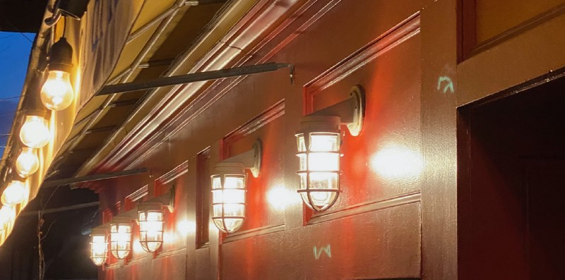

<!-----
title: Heroin Holiday in Brighton Beach
description: About the time I went to a holiday party on the Upper East Side and listened to someone I barely knew tell me my childhood neighborhood…
date: '2019-12-28T00:38:43.097Z'
slug: 88639a101c2a
----->

<!--A shot of some tasteful lights hanging in front of as restaurant in Park Slope, Brooklyn. (Photo by Jack Szwergold; Taken December 27, 2019)-->

I wasn’t at rock bottom but I sure wasn’t at the top either.

I had moved back to NYC in the fall 2000 with the wacky weekly newspaper, and my ass was unceremoniously canned in early 2001. In a power play, the creative editor, director and co-owner of the place was pushed out by the mouth breathing, pothead midwestern sub shop king. And — despite years of service at mediocre pay — I was culled our because I was apparently difficult to work with.

As I implied, the real cause for all of this was a power play to force the award winning editorial team to work more closely with the lunkhead boiler room business staff. Which was ridiculous.

The wacky weekly newspaper only became famous because of their content, not their ability to sell crappy local sub sandwich, pizza and beer shop ads. The final straw/excuse in my case was me telling the boss to literally go eff himself when he demanded I pull down the media kit I posted that was aligned towards editorial concerns and not his efforts to sell the place short for cheap ads and fast cash. Business efforts that — at the time — were somehow attempting to get escort and porn ads on the site to “make money” despite the fact that a Hollywood and TV execs were willing to cut deals with us.

I mean seriously, the wacky weekly newspaper literally just cut a few deals with a major movie and TV studios and part of the reason they moved to New York in the first place was to take advantage of that synergy to grow the brand. Despite all of that, the pothead sub shop king of Milwaukee was always looking for ways to sell the brand — and his staff — short.

***

Anyway I was unceremoniously canned from the gig that made my career and was — for all intents and purposes — blacklisted from certain media world. I couldn’t get a basic “Yes he worked here and did this…” reference from the wacky weekly newspaper to save my life and I was desperate. If their goal was to destroy me, my career and my life they were close to doing so. My parents were dead, my siblings were born again Jews who opposed my secular life and I had nowhere to turn to.

Happily — through friends of friends — I got a job as an all-purpose “web guy” at a fancy design and home decor magazine. I really couldn’t relate to much of their content, but it was a decent place to work because — despite their implied snootiness — the people I worked with directly were relatively down to earth. Yeah, some treated me as a redneck deep Brooklyn bumpkin, but it was a paying job at a place with a good name and I could have done worse.

And yeah, it was freelance gig before the “gig economy” was a thing, so it sucked from a stability point of view. But it was better than nothing because without a job I could not survive in New York.

During Christmas of 2002, their quirky and eccentric owner invited the whole staff of the publication to a holiday party at their Upper East Side home. It was exciting and nerve wracking feeling to be invited to such a place: Exciting because it meant I was accepted in some way to the “family” of the publication, and nerve wracking because I wasn’t rich or entitled and felt nauseous at the idea of being in a wealthy person’s Upper East Side home.

Long story short, I went and finally had some non-work time to meet and talk with some of the staffers I only really knew via email and not much else. It felt good to be included and be casual with co-workers I barely saw during the work day.

As I mingled and kibitzers, I casually told one person I grew up in Brooklyn and when they asked “Where?” I said “Brighton Beach” and they gasped. They were thrilled I grew up there. And — better yet — they were not asking me if I was Russian which was a relief; nowadays most people so connect Brighton a Beach with the 1970s Russian immigrant wave it was if people like me didn’t exist. Anyway, they excitedly waved at a friend of theirs to come over over and then this happened.

Some guy comes over and hear’s I’m from Brighton Beach and tells me how much fun he and some friends had there. I nodded politely and asked what they did; expecting to hear about their epicurean experiences at a Russian cafe or similar nonsense. Without hesitation he told me him and some friends of his took a long weekend off, rented an apartment and just did heroin all weekend. I looked him up and down; he didn’t look like any of the neighborhood junkies I grew up with. He looked downright suburban, basic and clean. I never met anyone who did heroin and was not a lowlife skell so this was all new to me. He described how nice the place was, how nice the landlord was and how great the neighborhood food was while he was there.

Then the appetizers showed up.

A waiter leaned in with a tray of small bites and this guy I was talking to was excited. His friend — who I worked with — said how it was easy to fill up on appetizers at parties like this.

I grabbed an appetizer, looked around and tried to figure out how to get out of this awkward heroin conversation. The apartment was filled with model boats so I excused myself, found my boss and talked to him — and others near him — about the boats.

Soon I found out he liked boating and yachts, so I bullshitted my way around this small talk until it felt like it was the right time to leave.

And soon — as if our internal “time to leave” party clocks were all in sync — a whole mess of us decided to leave.

As we all walked out into the dark, cool December night, a few co-workers talked about going to see the new Spider-Man movie. They qualified it all by saying it was a stupid superhero film but they heard it was good so why not?

Being welcome and being a part of the group were two different things. And knowing I was a relatively new member off this magazine’s staff, I demurred and said good night.

I bid farewells and as we approached Park Avenue I split off from the pack and headed to the subway to head back home to Brooklyn.
