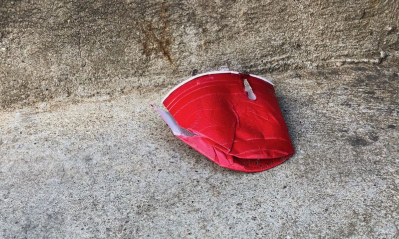

<!-----
title: High Functioning Comedy Genius in an Ape Suit Enjoys the Bacchanal
description: About the Time I Went a House Party and Watched a Co-Worker Molest a Catatonic Woman
date: '2018-07-15T23:27:48.739Z'
slug: 2bb9851d8f9d
----->

The party was weird because it was fun. It was honestly the first real house party I had been to in Madison, Wisconsin that wasn’t just a bunch of people drinking beers and smoking up at the hipster “Paper Towel Museum.” It was also weird because Rob — our newspaper’s managing editor — actually showed up and was actually drinking and seemed to be acting like a normal human being for once.

I wandered about and checked out the scene: The ground floor was like every other party with the obligatory keg, tons of people and some crappy piles of snacks in paper plates on a table. I grabbed a red plastic cup and a handful of pretzels and walked downstairs to the basement.

The basement scene consisted of some shitty noise DJ playing and lights blinking and not much else. Once my eyes adjusted, in the corner — near what seemed to be the entrance to a laundry room — was DJ DangerBear or MouseHead or some bullshit DJ name like that. He was simply standing there and tweaking some mixers and effects boxes to a room of of mostly nobody. Well, there was technically at least a few “somebodies” there: I was there and so was a fellow staffer at the newspaper, Todd.

Todd was dressed up in some improvised garbage hipster outfit that consisted of the body of an ape suit with the front unzipped and no ape head: Just his sweaty long-haired head and face bobbing up and down in its place.

“Isn’t this great!!!” he said while bobbing arrhythmically the distorted electronic skronk playing through the sound system. I turned around and saw some people come downstairs, look around and then head back upstairs and was contemplating their quick wisdom.

It seemed that Todd and I were DJ WhatTheFucks’ only audience at that moment. “I can’t believe they got him!!!” he said, bobbing his head some more and taking some drags off of the cigarette in his driving glove covered hand.

I nodded politely and then headed back upstairs.

Upstairs, it was a bit more crowded, but not that bad. I spotted Rob and he was drunk which was amazing because I really can’t recall ever seeing Rob be drunk or even drinking before this party.

“Jack!” he said.

“Rob!” I responded as he placed a hand on my shoulder, leaned in and said, “I’m drunk.”

“Okay,” I said as I stood there and nodded in agreement.

The pregnant, awkward pause went on a few beats longer than expected so I said, “Hey! Let’s go upstairs.” And with that we went ahead and headed up to the second floor.

Make no mistake, this wasn’t a romantic invitation by a long shot. I just needed a change of pace and needed to see what was happening on the second floor of this house.

The second floor was pretty chill. Kind of like the scene on the first floor but with more seating, better lighting and a wee bit less bullshit.

That said, while there was a huge room with a lot of open space, there wasn’t a lot of room to actually sit. So Rob and I sat out on a bench in the hallway near the bathroom.

Rob was generally a quiet drunk for the most part, but did unexpectedly blurt out “She’s got a nice tushy!” when some woman with a genuinely nice ass walked by us to wait in line to get to the bathroom. “Yup!” I said in agreement.

After a while, I felt the need to not be near Rob, so I stood up and headed back into the main room on the second floor.

As I walked in I spotted Todd again, standing around and endlessly yammering about how great DJ WhoGivesAShit was. I walked over said “Hi!” and he immediately dragged me into the conversation. “Wasn’t DJ WhoCares great?” he asked me to which I nodded and shrugged and said “Yeah…” and then left that as that.

“Cool,” the person he was talking to said and then followed up by saying, “Hey! There’s Anne!”

I had no idea who this “Anne” was but turned around and saw Anne herself. She looked like an indie/punk/D.I.Y. version of Velma from _Scooby Doo_ — or Enid from _Ghost World_ — which easily describes about 70% of the indie/punk/D.I.Y. ladies out there.

She walked over and said “Hey!” to us all but was noticeably a bit stiff. I soon found out she was a local zinester; meaning she put out a zine. And in this case the zine was called something like “Baby Food” so her zine hipster name was “Baby Food Anne.”

We chatted for a bit and then I noticed something magical: Two people had gotten up from two chairs. So I went in sat down in one of them.

The chairs were simple, old school living room chairs. Kinda like the ones that Archie and Edith sat in on _All in the Family_. Todd didn’t sit down, but Rob — who somehow wandered into the room — did and we had an odd mumbling conversation.

I mainly nodded at him and laughed a bit, but had no clue what his mumbling drunk mouth was talking about. Better just go along with a rambling drunks conversation than not, right?

After some time passed — maybe 5 or 10 minutes — I turned around and saw Anne standing there… But she was acting weird. She was stiffer than before — but clearly still conscious — and was catatonic and staring out into nowhere.

I stood up and stood right in front of her and she barely moved. Her head and eyes twitched a bit but in general seemed to stand there like a stiff, malfunctioning robot.

Someone who knew her better than me came by, and explained to me in a matter-of-fact tone that I shouldn’t worry since she fell into catatonic states like this all the time and it was no big deal. I nodded an acknowledgement at them and then looked at Anne and just accepted it as is.

Just as I was about to walk away, Todd showed up and said, “What’s up?” I pointed to Anne and said, “Look at her. She’s fucked up.”

Todd looked at her and then just said, “So what? It’s no big deal,” pushed past me and grabbed Anne from behind her head and just kissed her. I was close enough to see what he was doing was the equivalent of kissing a mannequin. Her lips barely moved and wherever her mind was at that moment it clearly was not there.

He pulled his head away and said, “It’s no big deal…” again, put down his drink on a small side table in-between the two chairs and then went back to kissing her. But this time his right hand was headed straight to third base, right down the front of her jeans.

I took a few steps back and didn’t know what to do. Or if doing anything would have mattered at this point. I looked at Rob drunkenly staring out into space — oblivious to what was happening right behind him — saw the chair I was sitting in was empty and sat down.

It was about 2:00am and I was ready to go. But still couldn’t pull myself out of the chair. So I just sat there, looked out the second floor windows and waited for a bit before standing up, heading downstairs and walking back to my place.