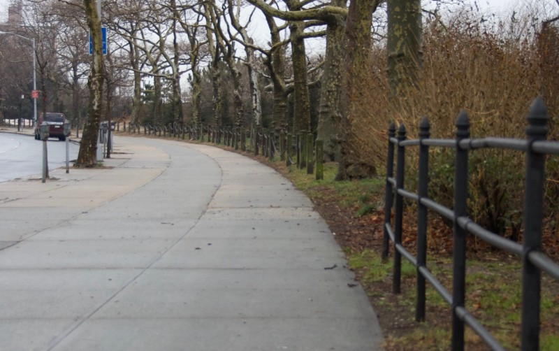

<!-----
title: Learning How to Ride a Bike
description: About the Time I Learned How to Ride A Bike on Surf Avenue
date: '2018-01-15T19:42:54.739Z'
slug: bd675ecaf17f
----->

I don’t know how old I was exactly — maybe 6 or 7 — but I knew I was a just a small kid and it was kinda cold outside. Everyone was dressed up in winterish clothes but it definitely wasn’t winter since there was no snow on the ground. All I knew was I was being taken outside to learn how to ride a bike. And it would have been pretty cruel to subject a kid of any age to do something like that if it was actually cold outside.

The whole family was there for the occasion… At least the whole family that lived in Brighton Beach at the time: Me, my dad, my mom and my older sister.

Anyone who knew my family at the time knew that organizing an event like that was a pretty big deal. Usually at least one family member stayed behind in the apartment to make sure things didn’t catch on fire or someone didn’t break in to our apartment to steal our stuff.

My dad decided the best place to teach a child of my age how to ride a bike was the sidewalk near the one sharp curve on Surf Avenue; the area right near the handball courts and public bathrooms on West 5th Street. While that description sounds disparaging, the location was a great choice in retrospect; it was a somewhat desolate and empty area far away from the judgmental eyes of the local Yentas and neighborhood kids. And since it was a long stretch of uninterrupted sidewalk, I had a lot of surface area to putz and putter around on with the bike before hitting a curb.

The lesson started out unceremoniously and simply: My dad who was walking the small red bike in the street stopped, talked to my mom and then asked me to sit on the bike. I went on and sat on the bike’s yellowed — but still cool looking — glitter covered seat, put one foot on one pedal and the other foot on another pedal and kinda rocked back and forth a bit.

My dad held the handlebars with both hands but then quickly shuffled to the side and held onto the handlebars with one hand and held onto the back of the banana seat with his other hand.

I was somewhat balanced in this setup, but it was clear that without my dad there to hold the whole thing up the bike would just fall down on it’s side with me sitting there going along for the ride.

As I sat and waited for something to happen, my dad said, “Okay… Push the pedals…” I did, but it was awkward and not really natural. With my dad holding on the bike like that it felt more like I was on a rickety merry-go-round with a worker holding the horse up than me actually propelling myself down the street.

I pushed and grunted a bit, but never was able to get my own balance in this setup.

This went on and on for a while. My dad holding the bike up, me trying to pedal and then the same thing up in an opposite direction.

After a while the whole family — my mom and sister — was involved in the process and took turns holding onto the other side of the bike as my dad continued to push and attempt to coach me along.

After a while the whole process became nothing but a stressful and frustrating exercise at best for all involved. All of the rolling up and down the same stretch of sidewalk gave me vague ideas of what I should be doing–and how bike riding should work — but it was hard for me to actually ride that bike given the situation. I mean, there I was with people literally hanging on so close to me — and literally arguing about what to do next — while I sat in the middle trying to get my own feel for the situation. I literally had no room to think let alone balance and process it all.

After a while, my dad gave up and called a break. We rolled the bike over to the iron fence next to a slim sliver of grass that sat next to the beach and boardwalk, walked through a busted opening in the fence and had an impromptu picnic right then and there.

The grass was clean but brownish and patchy in spots and my mom and dad laid out a small blanket on top of it. The blanket was an old brown and beige patterned blanket my parents got as refugees way back when and have always used since. The lunch consisted of Muenster cheese sandwiches, grapes and maybe a can or two of Mott’s apple juice; it was basically a larger version of the lunch I would take to school each day. Except this time the whole family was enjoying the meal.

I sat on the grass, unwrapped the wax paper from the half of a sandwich I grabbed from a brown bag, and tried to tune out my mom and dad as they argued in Polish or Yiddish or whatever non-English language they were speaking in at that moment. You didn’t need to know the specific meaning of what they were saying to understand there was some sort of heated debate happening regarding the best way they could teach me how to ride a bike.

My sister sat nearby and only said some basic and somewhat passive aggressive things to me about the whole experience as I sat there, ate and nodded politely. Nodding politely to here was often the best way to deal with her when she acted like this since there was always an undercurrent of meanness and nastiness to her interactions with me even when she was supposedly being “nice.”

As I was eating the sandwich I stared at the grass and then stared at the sky and was calm. My head was cool, clear and collected when I turned, looked at the bike, and suddenly felt my “I can ride a bike” neurons snap into place: At that moment, I knew how to ride a bike!

Within moments I stood up, threw the remnants of the sandwich on the blanket and ran straight to the bike.

“I know how to do it! I know how to do it!” I shouted as I grabbed the bike, straddled its seat, pushed down on the pedal and finally rode on my own down the block.

My balance was wobbly, but with each push of the pedals the feeling of natural balance — and what I had to do to maintain it — became clearer, more focused and natural. My focus was so clear I was able to calmly ignore the fact my mom, dad and sister were frantically chasing me down Surf Avenue as I rode away from them.

This all added up to one crazy feeling of freedom: While my mom and dad would always be able to catch up with me when I rode my tricycle or Big Wheel down the block, the feeling of freedom connected to riding a real bike was different. As crappy as this little red Schwinn bike was, I pretty much immediately realized this bike was still inherently fast enough to allow me to ride away from them! What a feeling!

But this feeling of freedom was cut short when I noticed some people in front of me down the sidewalk who — while not a part of my family — clearly noticed the small scene me and my family created and attempted to run, cut me off and grab me to help my parents out.

Instead of riding into this band of meddling outsiders, I awkwardly stopped the bike, turned the bike around and rode back towards my mom, dad and sister.

I pedaled a bit — at a speed that was neither slow nor fast — and coasted towards them. My dad came closer and gently grabbed the handlebar of the bike. The look on his face — and my mother’s — was happy and exhausted with a just a slight hint of concern. “Now you can ride a bike!” my dad said with a smile on his face as he puffed a bit harder than usual from running to catch me. My mom ran over and said, “Hey! Look at me!” which I did and then she grabbed my head and kissed me on the forehead.

In the near distance I could see my sister slowly walking towards us. She wasn’t running anymore and clearly wasn’t happy: She had a scowl on her face that I only I could see. She neither complimented me or insulted me. She just stood their glowering.

“Come! Let’s go back and get the blanket and go home!” my dad said. So everyone walked back to get the blanket… Except for me, who rode slowly next to my dad as his hand gently held one side of the handlebars to help me balance while pedaling along at slow speed.

Soon enough we were back home and the red bike was back in its usual place in the living room. My calves hurt a bit, but I felt fine.
