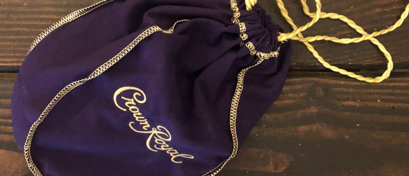

<!-----
title: The Bag of Jewelry
description: About the Time My Mom Found a Crown Royal Bag Filled with Jewelry on the Street
date: '2019-08-24T20:58:39.599Z'
slug:2dee5c4e34aa
----->

It was sometime in the 1980s in Brighton Beach, and my mom wanted to go out to get something from the supermarket across the avenue. It was either called Met Foods or Speedway; don’t remember when the name switch happened but it was still the same supermarket even with branding changes. Larger than a corner store and smaller than a “good” supermarket like Waldbaum’s or Pathmark. Whatever the size it was my family’s supermarket.

Anyway, just before the place closed — maybe 7:00pm or 8:00pm — when she headed out. “I need to buy something,” she said as she headed out the front door. My dad and I really didn’t know what she had to get, but who knew. We really didn’t stock up on anything past the basics in the pantry and my dad knew what we had. She most likely heard about something from one of her co-workers at the Gowanus sweatshop she worked in or someone in front of the building and just decided she needed it at that moment.

Anyway, after about 20 minutes or so the front buzzer rang, it was my mom and my dad went to the front door to open it up for her and she pretty much ran as fast as she could into the apartment. She was no sprinter, but the urgency of her pace was faster than her usual stroll.

As she waked in, she started to excitedly whisper to my dad in Polish or Yiddish — definitely not English — as they both hurried into the apartment and then straight into the kitchen.

After a brief pause, I stood up and headed into the kitchen to see for myself what the fuss was about.

I walked in, saw the brown paper grocery bag sitting on the kitchen table, but it was still packed and full. Instead, my mom and dad though were opening up a small-ish purple Crown Royal bag on the table and going through the contents.

“What’s in there?” I asked. And as my mom and dad looked at me I looked at the table and saw for myself what was in there: It was lots of gold and shiny things. “Jewelry,” my dad said. My mom added, “I find this in the street between this side and the other side,” which I knew, in her broken English, to me meant she found it on the median between on Brighton Beach Avenue between the block our building was on and the supermarket across the street.

I leaned in closer to check out the haul: Lots of jewelry. Lots of gold colored pieces of jewelry. Were they real or fake? No clue. But lots of gold-ish chains and other stuff… But mainly gold-ish chains.

I felt excited for us. No idea what anything was worth — or where this Crown Royal bag came from — but I knew one thing: My mom would sell it at the local jewelry store a few blocks away and that would ease our family’s poverty a bit.

“Don’t tell anybody,” my dad said. And I knew what he meant. Life was hard enough without neighborhood Yentas, gossips and low lifes knowing that we found this haul.

Where did these things come from? Who owned this stuff? Was the stuff stolen? Did it all belong to one person if stolen? Was there anyway to return the stuff?

Nothing was practically of concern at that moment past the fact that whatever my mom just found was worth something. And to a family that was poor, that meant some kind of magical bonus that could help us survive. And that’s what was important.

A week or so passed, and I don’t know when she did it but she definitely sold the haul to the local jeweler.

I didn’t go along with her at the time — I was too old to tag along on those trips — but I liked the jeweler and only have fond memories of him. He was an older Orthodox Jewish guy who seemed to be perpetually dressed in a white shirt, grey slacks, balding head, big beard and a Yarmulke. He wasn’t really a neighborhood guy, but my guess is he lived on Borough Park and simply owned the store in Brighton Beach.

When I was younger, my mom would drag me along to the shop. Like most low-rent neighborhood jewelry shops, it had a small array of goods for sale, but it also acted like a pawn shop for the neighborhood.

It was one of those known secrets that everyone knew about and nobody made a fuss about: With no questions asked — or judgements made — you could just bring your stuff in, he would take a look at it with the jeweler’s loupe he had hanging around his neck, negotiate a sale price and that was that. Quick and easy cash.

So with the jewelry sold, all that was left was a purple Crown Royal bag that she kept on her dresser.

A few weeks had passed and my brother called for his weekly family check in. His check in calls were tedious for me at best but I knew the routine: Waited a short bit for him to talk to my mom and dad and then I got on the phone and talked to him to “make him happy” or something.

So a short while after talking to my mom or dad, my mom or dad would walk over to my room and say “Ben wants to talk to you…” Then I’d drag myself to the phone, and engage in some pandering idle chit chat with my “brother” (who I never had a relationship with) who was 20 years older than me as if I cared. At some point he would always say I was “always welcome” to visit him and his utterly miserable wife in Washington Heights. At no point did he ever get the hint I hated visiting him up there nor that I found these “glib” conversations of any value at best.

So after some chit chat — and just when I thought I could get off the phone and get back to doing anything else — he told me his miserable wife wanted to talk to me. I really braced myself when this happened, because while my brother could be easily distracted and entertained, Karen (the miserable wife herself) was a stubborn, nasty and massively passive aggressive piece of work herself.

She was a math teacher who studied at the Bank Street College in the West Village in the 1970s; thus she was a kind of “down-to-earth” yet condescending and elitist know-it-all who “pitied” my public school life and would try to “save” me from my dreaded non-Montessori-based education. She also creepily liked to engage children of all ages as if they were all the “same age” so that made it even weirder.

Anyway, so here I am talking on the phone to her and none of my generic chit-chat items would stop her from prying into my teenage life. “Really?” she would say and “What else is happening?” she would add when I tried to lob verbal distractions her way. Typed out that seems innocuous and silly to get upset about. But when you have a full grown adult — who is 20 years older than you — prying into your teenage life it all added up to just being a pile of anxiety inducing bullshit.

At some point she managed to genteelly break down my will enough so that I would blurt something out I didn’t want to share. Such as me letting something about the Crown Royal bag slip out to her.

Within milliseconds of me saying something about the jewelry filled Crown Royal bag haul she said, “Well you should return it to the police.” Which anyone who knew anything about finding stuff on the street in a poor neighborhood would know was stupid on so many levels.

First, the chances of the police being able to reunite the jewelry with the original owner — or owners — was pretty much zilch. Second, if you brought to the police into something like that you ran the risk of being known as a rat in the neighborhood. Taking the jewelry and selling it was actually the best — and most realistic — thing one could do all things considered.

But my loose lips slipped and the damage was done. I blurted out something I should have not blurted out and now my brother’s miserable wife was going to start a fight with my parents about the jewelry.

I handed the phone back to my dad. And after a pause you could tell she started ripping into him. I have no idea what she said, but my father got visibly agitated by it. He was shouting and his faced was getting red. After a while he asked that he talk to her husband — my brother, his son — again.

My dad was still riled up about it, but when he talked to my brother — in between the Yiddish or Polish being spoken — he clearly said in English, “It’s none of your business!”

And after a few minutes, he hung up the phone, took a deep breath and looked at me. He calmly — but in a breathless way — simply said, “You shouldn’t have told her.” And he was right. I shouldn’t have told her. And I felt horrible.

He went back to the living room and sat on the couch watched TV. I waited a minute or so and joined him. He was calmer and wasn’t that upset anymore. But I was still regretting what I said. He saw this and said, “No big deal. We sold the stuff anyway.” And patted my hand.

We both sat there and watched TV for the next 1/2 hour or so before turning in for the night.