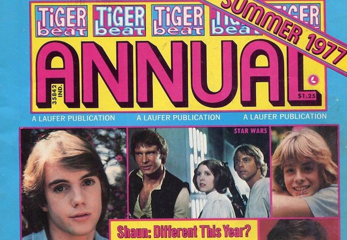

<!-----
title: The First Time Any Gal Saw My Junk
description: About the Time Me and an Elementary School Friend Played an Improvised Game of ”Show and Tell”
date: '2019-01-27T19:03:39.622Z'
slug: 70076f6b8dba
----->

<!--Details of the cover of the Summer 1977 “Tiger Beat Annual” my classmate was flipping through. (Cropped from a image of the issue found on Amazon or eBay.)-->

It was the fall of 1977 and every kid in the neighborhood either had seen _Star Wars_ already or knew what _Star Wars_ was in some way.

That sets the scene for the odd encounter I had with two classmates — Lori and Lauren — at a table in the cafeteria at P.S. 253.

Me and a friend of mine were sitting at a cafeteria table in the lunch room across from Lori and Lauren. By 9 year old standards we were flirting with each other, but we were all too young to really understand what flirting was past petty acts of teasing that didn’t exactly devolve into bullying.

Lauren — who was a bit chubby and sleepy eyed — was flipping through a copy of _Teen Beat_ magazine that featured Mark Hamill on the cover and asked me “So, you like _Star Wars_?” To which I replied, “Yeah, I do.” She then looked through her copy of _Teen Beat_ and tried to find some pictures of Mark Hamill and _Star Wars_ related stuff like that.

Her pal Lori — who always sat right next to her — had longish blonde hair that was braided on both sides and a huge honking set of braces in her mouth. Despite the fact she Lori was known as an extremely slow eater — she was eating that peanut butter and jelly sandwich slower than sloth chewing on a twig — she was really cute by my own elementary school standards.

When Lauren finally found some pictures in her copy of _Teen Beat_ she leaned over to Lori, showed them to her and they both giggled and then showed the pictures to me and my friend.

The pictures really sucked by 9 year old boy standards. They were basically the same crappy black and white promo shots of Mark Hamill, Harrison Ford and Carrie Fisher you saw everywhere at the time. A few shots were just shots of them casually walking around Hollywood or wherever doing not much of anything. They were just boring paparazzi star-gazing shots that I couldn’t care less for.

“So what,” I said dismissively as I passed the copy of _Teen Beat_ back to Lauren. “Those are boring,” my friend added.

Lauren, a bit dejected, took back the copy of _Teen Beat_ and started to flip trough it again.

Lori looked at Lauren, stopped eating her peanut butter and jelly sandwich and simply said, “Well, what you have to show us?”

I looked at my friend and we both shrugged. What the heck did Lori want us to show them? I rifled through my jacket pockets but didn’t have much to show past maybe a few coins, a _Star Wars_ card or two and maybe a Matchbox car. Basically just elementary school boy bullshit and lint and not much else.

I took whatever I had out, showed it to Lori and Lauren and then they just rolled their eyes and went back to whatever they were doing.

Then my friend — seemingly out of nowhere — blurts out, “Hey! Do you want to see our pepes.” And by “pepe” he meant “pipi” and by “pipi” he meant “penis” since all of us kids knew “pipi” was just cute slang for the “penis.”

Lori and Lauren looked at each other, then looked at us and simply asked, “Where?” Lori stared at us and began eating her peanut butter and jelly sandwich again while awaiting our response.

“Here!” my friend said as he looked at me while shaking his thumb at me under the table and nodding “Yes!” to me.

I took that thumb to mean “Thumbs up! All cool!” and didn’t think too hard about it meaning anything else. So with that we both unzipped the zippers on our pants and got ready to show them something.

“Look under the table!” he said to them.

And with that, I pulled my 9 year old “pepe” out of my pants and held it out there for Lori and Lauren to check out.

They both leaned under the table to see what they could see. I leaned back a bit to see what was happening and then saw it: While I had my actual “pepe” out, my friend just shoved his hand down his jeans and shoved his thumb through the zipper.

“You’re cheating!” I whispered and then he looked at me, gasped and said, “Why are you really showing it?!?”

We both leaned forward again as Lori and Lauren both pulled their heads out from under the table, stood up straight and looked at us… Both red faced and giggling.

They didn’t say much about the difference between me and my friend either showing off a thumb versus the “real thing” but Lori was red faced and smiling at me for the rest of the lunch period as she finished off that beloved peanut butter and jelly sandwich of hers.
