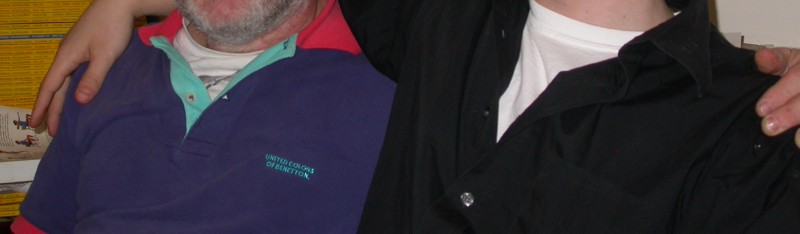

<!-----
title: The Last Passover I Had With My Family
description: About the Last Passover Dinner I Ever Had With My Brother and Sister
date: '2018-04-15T17:47:00.325Z'
slug: 719887892680
----->

While my parents were Jewish, the home my parents raised me in was secular. My parents weren’t in denial of our Jewish background, but rather simply aware of the basics and not much else. To his literal death my father would say that religion was “bullshit” and would often ascribe what he defined as “bullshit” to the way God treated the Jewish people during the Holocaust. If there is a God, why would he/she/it ever allow such a tragedy to happen? As a child I often wondered if my parents were somehow faithful before World War II and then suddenly dropped their religion after the war. But as an adult whose learned some more about my own family’s history over the years, I’ve grown to realize there’s no history of religious faith or deep belief in my family past the usual, “This is our community and this is what we do…” mentality. My family is historically secular.

In contrast, as my siblings grew older they all started to take their belief in Judaism to deeper and deeper extremes. For example, while our family never really observed Passover, my siblings saw it as some deep obligation to force a “real” Passover experience down the collective throats of our whole immediate family.

Which is all to say: While I saw Passover as simply a unique holiday where Jews got together to simply get together — such as a Jewish version of Thanksgiving and such — my brother and sister took it far more seriously than anyone else I knew.

So I attended these events — way past my childhood obligation — not because I somehow believed the magical spirit of Elijah the Prophet would show up to drink a goblet of wine set on the table for him or some bullshit like that. I attended because both of my siblings families have dealt with a lot of sad and violent dysfunction over the years — divorce as well as physical and psychological abuse — so I saw my attendance as something that I could do to add a layer of normalcy to the immediate family’s lives. A layer of normalcy that I especially hoped would help my nephews and nieces who — despite their obvious lack of deep religious faith themselves — seemed to need some stability in the midst of familial chaos and bullshit they were born into.

Anyway, it was April 5, 2004. I was prepared as much as I could to participate in my sister’s Passover seder. I showed up as I always did and met the family that was there as well as the small group of friends my sister had at her local Temple.

As usual, we waited for my brother and his kids to show up. This was fairly typical: My brother and his kids would show up whenever they wanted to despite set times and when they showed up they barely apologized for any difficulties or frustrations their lateness caused. “Don’t sweat the small stuff! And it’s all the small stuff.” my brother would always shout. And we all nodded politely and tolerated it because there was not much we could do to change it.

So when my brother finally showed up, he showed up with my niece, who seemed not into the idea of attending this event at all. But there was no sign of his son; my nephew.

This seemed odd at the moment. My nephew lived in Brooklyn — in Prospect Heights — while he went to school in Manhattan. So while it was his job to get to my sister’s home on his own, there was little to no reason he had to be late like this at all.

“Where is he?” I calmly asked my brother, to which he shouted, “I don’t know!!!” which was a warning of things to come; my brother was getting revved up at the idea of anyone questioning anyone in his direct family for any reason.

We all waited some more. So much so that sundown had already passed and — technically — we were late for the start of Passover.

Everyone was clearly antsy, but nobody wanted to start the Seder without my nephew. And given his response to my simple question, even less people dared to ask yet again, “Where is he?”

But then my brother got on the phone with my nephew and it turned out he forgot today was the Seder at all. He was still at home in Prospect Heights after spending some of the day at his grandmother’s home completely oblivious to the family he had just blown off.

We all found out about this after my brother hung up the phone and told us all adding a “This is no big deal!!!” to the end of the explanation to preemptively shut us all up. There were 8 to 9 people sitting there, doing nothing, waiting for the Seder to start but it was supposedly “No big deal!!!” that his son had forgotten about it.

Then, in the middle of the awkward silence something odd happened. My sister, who never really spoke up about anything, suddenly spoke up and said something to the effect of “If this was his grandmother’s Seder and any of us were late, we would be getting grief!”

Like I said, my sister never really spoke up so this was all shocking and amazing. When she was a in a shitty abusive relationship with her ex — and now dead — husband she said utterly nothing. When her own brother turned a blind eye to the abuse she endured at the hands of her ex-husband she said nothing. She was practically a human doormat when it came to people in power in her life who treated her like crap and truly never spoke up… But today was amazing! She finally spoke up! This was truly a Passover miracle!

I was thrilled for a second or two… But that thrill quickly turned into terror as my brother — like a mad animal — instantly rushed at her, grabbed her by the shoulders and shoved her against the wall. “Don’t talk about my son this way!” he screamed as he pushed her against the wall. “Don’t lie!” he added.

I ran out into the hallway to see what was happening and he immediately shouted at me, “Stay out of this!!!” His hands were clenched on my sister’s shoulders as she stood there silent and lifeless; like a rag doll.

Despite his threats, I walked towards him and said, “Leave her alone! She said the right thing! Why do we have to wait for your family all the time?” He turned to me and started barking again. I walked past him, walked into the kitchen and stood near the phone.

As I looked at him holding her against the wall, I looked over at the phone and did not know what to do. My arms were crossed, my fists were clenched and my brain felt like it was about to explode. If I called the police, what would happen? My brother and sister are masochists; it would end up being my word against theirs because my sister would not fight back and would pretty much claim nothing happened. Her friends in attendance would not speak up at all for similar reasons; when power speaks reality takes a back seat.

Then I turned and looked at all the the stuff near the sink and saw a huge kitchen knife; maybe if I stabbed him he would stop? But then again, what would have happened? I would have stabbed my own brother, my sister would most likely blacked out the whole incident and claim she has no idea what would have happened as well. If I stabbed him I might have gone to jail for assault despite the fact I did so to defend my own family because “That’s just the way it is…”

After a few minutes things started to calm down. His hands were still on her, but at least was calm enough that I could walk past them and back to the living room. There I saw my niece curled up in a fetal position on the couch. I asked her if she was okay and she lifted her head: While she nodded her head to indicate she was okay, it was pretty clear from the glistening of tears and redness in her cheeks she was anything but okay.

I walked deeper into the living room and saw the menagerie of supposed “friends” from Temple my sister had. They all sat there motionless like a bunch of brainless cows standing in a field. Not one of them stood up and said or did anything throughout this incident. Not when it started or even now when it ended. They sat their patiently, submissively and obediently all the while; not even asking me how I was doing or even moving an inch to comfort my niece who was still crying on the couch.

I looked at them all, turned my head, found a seat and sat down to wait… To wait for my nephew to finally show up so we could all — as a “family” — celebrate the magic of Passover.

Some short time later — after dust had settled and everyone was a bit more composed — the front door buzzer rang and there was my nephew. He was was immediately apologizing and putting on a charm offensive to make nice to everyone. It all seemed fake, self-serving and heartless but at least we could start the Passover seder as if nothing had happened, right?

He was apologizing so much that at some point — when he was out of range of my brother — I went over to him and said, “Just sit down and let’s have a meal…”

So as the Seder began, we all read from the Haggadah. The basic tradition was we all took turns to read one paragraph and then let someone else read. But when it came time for my nephew to read he just didn’t stop. First he read one paragraph, then he read a second paragraph… And then a third… It didn’t stop. This was socially awkward and selfish.

As each obvious paragraph break happened I attempted to speak up to say he should allow others to read, but my brother and sister continually shushed me and shut me down. My sister’s friends from the Temple said nothing; but that isn’t fair to them… The reality is nobody said anything. And I just accepted the reality of the situation and went along with it.

Soon enough, the annual amateur Biblical bullshit recital known as the reading of the Haggadah ended and we were actually eating a Passover meal of some sort. Everyone was focused on the food in front of them, but as I ate I looked around and saw nothing much else other than abusers, the abused and the people who sat back and said and did nothing while abuse happened.

While other Seders my brother and sister dragged me to in the past had given me headaches, the feeling of emptiness, dread, death and a general feeling of “Why am I wasting my life?” washed over me.

“Never again,” might have been the two word rallying cry Jews all over would would repeatedly say in reference to the Holocaust, but in my mind — after seeing what happened to my family during this specific Passover — “Never again,” was my own personal rallying cry to finally remove myself from this specific cycle of violence and dysfunction in my own family.

When I left my sister insisted I take home some leftover food from the Seder despite my very clearly stating that I didn’t want anything. So I rode the subway home to my apartment with a few containers of food I did not want. And when I finally got back to my home, I took off my jacket, went to the bathroom, lifted up the toilet seat and just flushed the food she gave me straight down the toilet.