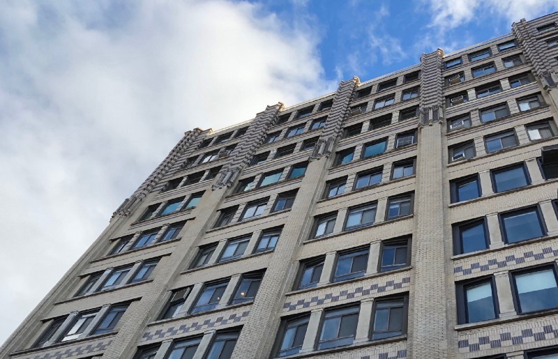

<!-----
title: The Time I Discovered a Cool Toy Store on Bleecker Street
description: About the Time I was Dragged to Greenwich Village by My Sister and Her Husband on Some Sandal Buying Trip and Discovered a Cool Old Toy…
date: '2018-11-17T00:49:57.458Z'
slug: 8710c9347cf7
----->

I don’t remember the exact year this all happened, but I do know it was 1978 or 1979 and I was in Greenwich Village with my sister, her husband and her husband’s brother on another one of their horse-shit adventures.

I often got dragged around on these horse-shit trips like this because my parents were old, and my siblings were younger and thought I — based purely on age difference — would like being dragged along on these afternoon dates. Never mind the fact that I liked playing out on the street in front of my building instead of hanging around with people in their 30s, they always seemed to figure out a way to drag me along. As if dragging me out of the home and neighborhood I loved was a “good deed” or some self-congratulatory shit like that.

Anyway, my first memory of the trip was going to some custom sandal shop on West 4th Street near Jones Street. Pretty sure it was Allan Block’s famous sandal shop, on West 4th but don’t quote me on that. Apparently my sister’s husband wanted to get some leather sandals and my presence sitting around and doing nothing was required for some reason.

I remember him and his brother were (presumably) high on marijuana or a beer or two and laughing and goofing around in the sandal shop while my sister and I waited like dogs outside of the shop.

At some point I stood up and literally said I was bored because what was “fun” about just sitting outside of a sandal shop while stoned family members shopped for sandals inside. So after some protests and negotiation on my part, my sister agreed to walk me around the block to alleviate my boredom.

All my complains aside, this was definitely the first time I was ever in Greenwich Village, and the place seemed interesting. The streets were tree-lined and nice. I didn’t see the typical signs of the poor working class life I knew in Brooklyn on the streets of Greenwich Village — like garbage, stray cats, drunks and random piles of dog shit — but things in the neighborhood seemed nice and friendly as far as I could tell.

As we walked around, at some point we hit Bleecker Street. I remember it being sun drenched and pleasant and more of a shopping strip than the side street we were just on. Just as we were about to turn down to head back to the sandal shop, I spotted what looked like a brightly painted carousel horse in a nearby shop window.

“I want to go there!” I told my sister who quickly responded, “We don’t have time! We need to go back!” And this went on, back and forth, for a bit until I convinced her to just let me look in the window of the shop.

So I walked over to the shop and took a look in the window. It was definitely a toy store, but not like any toy store I knew of. For one, the window not only had a carousel horse in it, but there were also all kinds of old toys nicely displayed in the window as if they were museum pieces.

That was cute, but of no interest to my 1970s street kid sensibilities. Then I saw something in the window that grabbed my attention: A huge bowl filled with what looked like wind-up R2-D2 toys! What the eff was that? I already had a small collection of Kenner _Star Wars_figures, but never saw a wind-up R2-D2 before. They looked similar to the Kenner version of the R2-D2 figure but each had a small tag with some Japanese text on it.

I gasped and immediately checked my pockets for money. I had some quarters and other miscellaneous loose change on me; maybe I could score a wind-up R2-D2 from this shop on this horse-shit “family” trip? So I went over to my sister and asked her if we could go into the store so I could buy a wind up R2-D2.

“No!!!” she shouted. “We need to go back!” she added, visibly upset at me being so willful. And this went on for a little bit until I accepted the futility of the struggle, caved in to her demands and headed back to the stupid sandal shop with her.

As we walked away from Bleecker Street I made a mental note of the cross-street we were at. Perhaps I could convince my dad to go to this toy store some other weekend?

Anyway, after walking a short bit back to West 4th Street we were back at the beloved sandal store. My sister’s husband was out in front waiting with his brother and instantly complaining about her being late.

“Jack saw a toy store,” she said condescendingly to her husband. Her husband then looked at me and sternly said said, “No toys today, Jack.” And with that we all headed down the block to his brother’s place.

While the Village was filled old school pre-World War II NYC brick buildings, my sister’s husband’s brother lived in something that looked like a drab soulless condo building on Cornelia Street. On a street with beautiful old New York City buildings, this guy lived in quite possibly the ugliest building on the block.

We went inside, rode up the crappy elevator and before you knew it, we were in his place. To be fair about it all, the inside of his apartment seemed cool and homey compared to the outside of the building. It was filled with sun, plants and nice-looking wood furniture. In its own wait, it kind of looked like the cover to Carole King’s “Tapestry” but without Carole King or a cat anywhere.

I walked inside and sat on a couch. Not much for a kid to do in this place; no better than just sitting in front of a sandal shop, like some dog, on West 4th Street. Someone gave me a glass of water and I basically sat around, drank some water and stared for a bit.

After a while, my sister, her husband and his brother sat down near the coffee table that filled the center of the living area. My sister’s husband started to roll up a joint and his brother talked in hushed tones as he looked at me. My sister just sat there, pretty catatonic.

At some point in the middle of my boredom I spotted something to play with: A Play-Doh barbershop set! Cool! It was still in it’s box, so I walked over grabbed it and started to open the box when my sister’s husband’s brother stood up, grabbed it out of my hand and said, “No… That’s not for you.” And put it up on a table.

By then, the literal joint was lit and my sister’s husband took a puff and then passed it onto his brother. My sister sat still and didn’t participate and wasn’t even offered the joint. This went on for a while with the two guys smoking and joking and me — being a kid — feeling trapped in the middle of this and my sister sitting there and doing nothing like some kind of robot that had just shut down.

At some point, my sister seemed to “snap out of it” stand up and said something. I don’t really remember what she said, but I do know that her husband instantly stood up, walked over to her and forcefully shoved her back onto the couch and just started yelling at her. With her ass back on the couch she just shut down again and sat their like a sack of potatoes and just took the abuse; head down, pigeon toed and silent.

I had no idea what to do, but I looked at the my sister’s husband and his brother and half expected them to start yelling at me. But luckily other than a brief glower or two from them I was spared from their arbitrary violent outbursts.

I turned and looked out the window and found some comfort in the sun and shadows cast by the plants in the window. And I also made sure to keep a mental note of the cross street near that cool toy store; this trip to “the city” stunk, but at least if I remembered where that toy store was I could get something good out of all of this domestic bullshit.